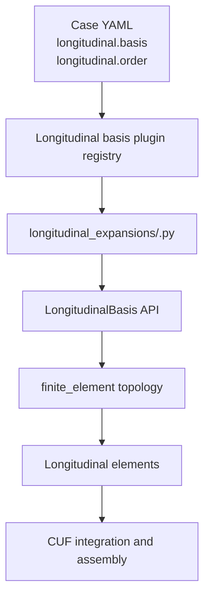

# Implementing a New Longitudinal Shape-Function Basis in CSF-CUF

> Version: CSF-CUF longitudinal basis implementation guide

## Purpose of this guide

This document is a practical implementation guide for a developer who wants to add, verify, and use a new longitudinal shape-function family in CSF-CUF.

It is the longitudinal counterpart, mutatis mutandis, of `scaled_lagrange_implementation_guide.md`: the same plugin-oriented principle is applied here to the approximation along the beam axis rather than to the transverse CUF expansion.

The important architectural point is:

> A longitudinal shape-function family is a basis plugin. It must not require a special branch in the generic finite-element implementation.

The current longitudinal architecture deliberately separates three different responsibilities:

1. the **finite-element partition**, which decides where the longitudinal elements are;
2. the **finite-element topology**, which decides how local coefficients are connected between adjacent elements;
3. the **longitudinal basis**, which supplies the local shape functions and their derivatives on the reference interval.

A new longitudinal basis belongs in:

```text
src/csf/cuf/longitudinal_expansions/
```

and reaches the solver through the common longitudinal basis API and plugin registry.

The generic FEM must not import the concrete basis and must not contain logic such as:

```python
if basis_name == "my_new_basis":
    ...
```

The implementation described here keeps the following boundaries explicit:

- the CUF formulation is not modified;
- the physical CSF description is not modified;
- the finite-element partition is not owned by the basis plugin;
- the basis plugin does not decide element connectivity;
- the generic FEM does not contain formulas for a concrete shape-function family;
- old YAML files remain compatible because `lagrange` is the default longitudinal basis;
- unsupported topologies must be rejected explicitly rather than silently interpreted as Lagrange.

The current built-in longitudinal basis is `lagrange`.

---

## 1. Where the longitudinal basis fits in the architecture

The longitudinal path is:



The finite-element partition is configured independently:

```yaml
longitudinal:
  method: finite_element
  element_boundaries: [0.00, 0.28, 0.50, 0.72, 1.00]
  basis: lagrange
  order: 12
```

Here:

- `element_boundaries` determines **where the elements are**;
- `basis` determines **which longitudinal shape-function family is used inside every element**;
- `order` is the user-facing approximation order passed to that basis plugin.

The basis plugin must not reinterpret or modify `element_boundaries`.

The basis lives on the reference coordinate

```math
\xi \in [-1,1].
```

The generic finite-element layer maps this reference interval to each physical element.

---

## 2. The current limit: `finite_element` requires a nodal C0 basis

The generic API starts from:

```python
LongitudinalBasis
```

which is not, by itself, restricted to a nodal representation.

However, the currently implemented longitudinal topology

```yaml
longitudinal:
  method: finite_element
```

accepts only bases implementing:

```python
NodalC0LongitudinalBasis
```

This distinction is important.

### 2.1 What the limitation means

For the current FEM topology, the local coefficients must be associated with reference nodes. Adjacent elements obtain C0 continuity by sharing the coefficient at their common endpoint.

Schematically:

```text
element e                 element e+1

 o------o------o------o------o------o
                    ^
              shared coefficient
```

For a nodal basis,

```math
u^e(\xi)=\sum_{a=1}^{n} N_a(\xi) q_a^e,
```

and the local coefficients `q_a` are nodal values.

At an interface, the right endpoint coefficient of the left element and the left endpoint coefficient of the right element can therefore be represented by the same global degree of freedom.

This gives C0 continuity of the represented displacement field.

### 2.2 What is not currently supported

A purely modal basis such as

```math
u^e(\xi)=a_0 P_0(\xi)+a_1 P_1(\xi)+a_2 P_2(\xi)+\cdots
```

may implement the generic `LongitudinalBasis` API, but its coefficients are modal amplitudes rather than nodal displacement values.

The current `finite_element` topology cannot simply identify one modal coefficient from the left element with one modal coefficient from the right element to enforce continuity.

Such a basis is therefore rejected explicitly.

This is a **topology limitation of the currently available FEM adapter**, not an assumption that all longitudinal bases must be Lagrange.

### 2.3 Do not fake a nodal basis

If a future basis is genuinely modal or non-nodal, do not invent `reference_nodes` only to pass the current FEM check.

That would create a hidden and mathematically incorrect assumption.

The correct extension would be to introduce a topology adapter capable of coupling the traces of that basis, while leaving the basis itself honest about its mathematical representation.

---

## 3. Current source files to understand before adding a basis

The relevant files are:

```text
src/csf/cuf/core/longitudinal_basis.py
src/csf/cuf/core/longitudinal_basis_plugins.py
src/csf/cuf/solver/longitudinal.py
src/csf/cuf/longitudinal_expansions/lagrange.py
src/csf/cuf/longitudinal_expansions/README.md
src/csf/cuf/case.py
```

Their responsibilities are deliberately different.

| File | Responsibility |
| --- | --- |
| `core/longitudinal_basis.py` | Mathematical runtime contracts for longitudinal bases |
| `core/longitudinal_basis_plugins.py` | Plugin registration and lazy discovery |
| `solver/longitudinal.py` | FE partition, element mapping, connectivity, and use of an injected basis |
| `longitudinal_expansions/lagrange.py` | Current concrete Lagrange basis implementation |
| `case.py` | YAML parsing, including the default basis name |

A new shape-function implementation should normally require a new module only under:

```text
src/csf/cuf/longitudinal_expansions/
```

If adding a new nodal C0 family requires changes in `solver/longitudinal.py`, stop and check why. A concrete basis should not require a new branch in the FEM.

---

## 4. The generic longitudinal basis contract

The base class is:

```python
class LongitudinalBasis(ABC):
    @property
    def order(self) -> int: ...

    @property
    def size(self) -> int: ...

    @property
    def polynomial_degree(self) -> int: ...

    def values(self, xi: float) -> np.ndarray: ...

    def derivatives_reference(self, xi: float) -> np.ndarray: ...

    def power_coefficients(self) -> np.ndarray | None:
        return None
```

Each item has a separate meaning.

### 4.1 `order`

`order` is the user-facing approximation order selected in YAML.

For example:

```yaml
longitudinal:
  basis: my_basis
  order: 6
```

The plugin receives `order=6`.

Do not assume in the generic architecture that `order` and `size` are the same concept.

### 4.2 `size`

`size` is the number of local basis functions and therefore the number of local longitudinal coefficients.

The generic FEM uses `basis.size` directly.

There is no generic requirement that:

```text
size = order + 1
```

That relation is true for the current polynomial Lagrange implementation, but it is not hard-coded as the general longitudinal basis contract.

### 4.3 `polynomial_degree`

`polynomial_degree` declares the maximum polynomial degree carried by one longitudinal basis function.

The generic solver uses this information in its automatic longitudinal quadrature estimate.

It must therefore describe the implemented basis honestly.

Do not return `order` automatically unless the maximum polynomial degree is actually equal to the user-facing order.

#### Current numerical scope

The current quadrature estimator expects a finite polynomial degree. Therefore, although `LongitudinalBasis` is more general than the Lagrange family, the current automatic quadrature contract is designed for polynomial longitudinal bases.

A genuinely non-polynomial basis would require an extension of the quadrature-requirement contract rather than an arbitrary fake polynomial degree.

### 4.4 `values(xi)`

For one reference coordinate `xi`, return all local basis values:

```python
values.shape == (basis.size,)
```

Conceptually:

```math
\mathbf{N}(\xi)
=
[N_1(\xi),N_2(\xi),\ldots,N_n(\xi)].
```

The FEM does not know the formula used to construct these values.

### 4.5 `derivatives_reference(xi)`

Return the first derivatives with respect to the reference coordinate:

```math
\frac{dN_a}{d\xi}.
```

The plugin must return derivatives with respect to `xi`, not physical `x`.

The generic element converts them to physical derivatives using its affine mapping:

```math
\frac{dN_a}{dx}
=
\frac{1}{J_e}
\frac{dN_a}{d\xi},
```

with

```math
J_e=\frac{dx}{d\xi}=\frac{L_e}{2}.
```

Therefore a basis plugin must not include the element length in `derivatives_reference()`.

### 4.6 Optional `power_coefficients()`

A polynomial basis may optionally expose every local function in ascending powers of `xi`.

If

```math
N_a(\xi)=\sum_{p=0}^{P} c_{ap}\xi^p,
```

then row `a` of the returned array contains:

```text
[c_a0, c_a1, ..., c_aP]
```

The method is optional at the abstract API level and may return `None`.

However, the current self-contained compiled displacement checkpoint uses this representation for the longitudinal basis. If the selected basis does not provide it, creation of that compiled checkpoint is skipped.

Therefore:

- it is not required to assemble and solve the FE problem;
- it is required if the basis must participate in the current polynomial compiled-field persistence path.

---

## 5. Additional contract for the current FEM: `NodalC0LongitudinalBasis`

A new basis intended for the currently available `finite_element` method must subclass:

```python
NodalC0LongitudinalBasis
```

and provide:

```python
@property
def reference_nodes(self) -> np.ndarray:
    ...
```

The reference nodes describe the local coefficients on `[-1,1]`.

### 5.1 Runtime-validated requirements

`validated_reference_nodes()` currently checks that:

1. the array shape is exactly `(size,)`;
2. every coordinate is finite;
3. nodes are strictly increasing;
4. the first node is `-1`;
5. the last node is `+1`.

Therefore a valid nodal basis may use non-equispaced interior nodes.

For example:

```text
[-1.0, -0.8, -0.2, 0.5, 1.0]
```

is topologically acceptable if the basis functions are consistent with those nodal locations.

### 5.2 Mathematical requirement that the plugin must verify

The current runtime validates the node coordinates, but it does not numerically prove the complete cardinal property for the plugin.

For a nodal basis used by the current FEM, the implementation should satisfy:

```math
N_a(\xi_b)=\delta_{ab}.
```

This must be part of the plugin tests.

In particular, the endpoint traces must satisfy:

```math
N_1(-1)=1,
\qquad
N_a(-1)=0\quad(a\neq1),
```

and

```math
N_n(+1)=1,
\qquad
N_a(+1)=0\quad(a\neq n).
```

Without this property, sharing the endpoint coefficient would not represent the physical C0 trace assumed by the current topology.

### 5.3 Recommended consistency properties

For the usual displacement interpolation, verify also:

```math
\sum_a N_a(\xi)=1
```

and consequently

```math
\sum_a \frac{dN_a}{d\xi}=0.
```

These properties ensure exact reproduction of a constant field and are valuable regression checks for a new basis implementation.

---

## 6. How the current FEM uses the nodal basis

The basis is not responsible for building the mesh.

The discretizer obtains the physical longitudinal domain from CSF and the partition from the case.

Two partition forms are supported.

### 6.1 Uniform element count

```yaml
longitudinal:
  method: finite_element
  elements: 4
  basis: my_basis
  order: 6
```

### 6.2 Explicit normalized boundaries

```yaml
longitudinal:
  method: finite_element
  element_boundaries: [0.00, 0.28, 0.50, 0.72, 1.00]
  basis: my_basis
  order: 6
```

`element_boundaries` are normalized coordinates in `[0,1]`. The FEM maps them to the physical CSF longitudinal domain.

The basis remains entirely local and reference-based.

### 6.3 Mapping reference nodes to each element

For a physical element `[a,b]`, a basis reference node `xi_a` is mapped using:

```math
x(\xi_a)
=
\frac{1-\xi_a}{2}a
+
\frac{1+\xi_a}{2}b.
```

Therefore non-equispaced reference nodes automatically produce non-equispaced physical interpolation nodes inside the element.

### 6.4 C0 assembly between adjacent elements

For the current topology, only the common endpoint coefficient is shared between adjacent elements.

Interior coefficients remain local to their element.

If a basis has `size = n`, a chain of elements is assembled conceptually as:

```text
[e0: 0 ... n-1]
             [e1: n-1 ...]
                        [e2: ...]
```

The topology uses `size` and `reference_nodes`; it does not require the concrete basis to be Lagrange.

---

## 7. Before writing a new plugin: verify the existing API

Run a small inspection first:

```bash
python - <<'PY'
from csf.cuf.core.longitudinal_basis import (
    LongitudinalBasis,
    NodalC0LongitudinalBasis,
)
from csf.cuf.core.longitudinal_basis_plugins import (
    available_longitudinal_basis_plugins,
)

print("LongitudinalBasis:", LongitudinalBasis)
print("NodalC0LongitudinalBasis:", NodalC0LongitudinalBasis)
print("available:", available_longitudinal_basis_plugins())
PY
```

With the current built-in implementation, the available registry must include:

```text
lagrange
```

Also inspect the current implementation:

```text
src/csf/cuf/longitudinal_expansions/lagrange.py
```

Use it as an example of the plugin boundary, not as a requirement that all future bases reproduce the same formulas or node distribution.

---

## 8. Create a new longitudinal basis module

Create a new module such as:

```text
src/csf/cuf/longitudinal_expansions/my_nodal_basis.py
```

For a basis that must work with the current FEM, start from this structure:

```python
# Version: CSF-CUF my nodal longitudinal basis v1 - YYYY-MM-DD
"""My nodal C0 longitudinal approximation basis."""

from __future__ import annotations

import numpy as np

from csf.cuf.core.longitudinal_basis import NodalC0LongitudinalBasis
from csf.cuf.core.longitudinal_basis_plugins import (
    LongitudinalBasisPlugin,
    register_longitudinal_basis_plugin,
)


class MyNodalLongitudinalBasis(NodalC0LongitudinalBasis):
    def __init__(self, order: int, *, my_option=None) -> None:
        if not isinstance(order, int):
            raise TypeError("my_basis order must be an integer")
        if order < 1:
            raise ValueError("my_basis order must be >= 1")

        self._order = order

        # Define the reference nodal coordinates owned by this basis.
        # They must be strictly increasing and include -1 and +1.
        self._nodes = self._build_reference_nodes(order, my_option=my_option)

    @property
    def order(self) -> int:
        return self._order

    @property
    def size(self) -> int:
        return int(self._nodes.size)

    @property
    def polynomial_degree(self) -> int:
        # Return the true maximum polynomial degree of one basis function.
        raise NotImplementedError

    @property
    def reference_nodes(self) -> np.ndarray:
        return self._nodes.copy()

    def values(self, xi: float) -> np.ndarray:
        xi = float(xi)
        # Return shape (self.size,).
        raise NotImplementedError

    def derivatives_reference(self, xi: float) -> np.ndarray:
        xi = float(xi)
        # Return dN/dxi with shape (self.size,).
        raise NotImplementedError

    def power_coefficients(self) -> np.ndarray | None:
        # Optional, but needed by the current polynomial compiled-field path.
        return None

    @staticmethod
    def _build_reference_nodes(order: int, *, my_option=None) -> np.ndarray:
        raise NotImplementedError


def _build(*, order, options):
    options = dict(options)

    # Parse and validate only options owned by this basis.
    my_option = options.pop("my_option", None)

    if options:
        raise ValueError(
            "my_basis received unsupported longitudinal.basis_options: "
            f"{sorted(options)}"
        )

    return MyNodalLongitudinalBasis(
        int(order),
        my_option=my_option,
    )


register_longitudinal_basis_plugin(
    LongitudinalBasisPlugin(
        name="my_basis",
        builder=_build,
    )
)
```

The implementation-specific work is limited to:

- choosing the local reference nodes;
- defining the shape-function values;
- defining the analytical reference derivatives;
- declaring the real polynomial degree;
- optionally exporting polynomial coefficients;
- validating plugin-specific YAML options.

No FEM partition logic belongs in this file.

---

## 9. Plugin registration and discovery

The registration block connects the YAML name to the implementation:

```python
register_longitudinal_basis_plugin(
    LongitudinalBasisPlugin(
        name="my_basis",
        builder=_build,
    )
)
```

The registry discovers modules lazily from:

```text
csf.cuf.longitudinal_expansions
```

Therefore adding a normal module to that package does not require a special import in the solver and does not require a branch in the registry.

Verify discovery with:

```bash
python -c "from csf.cuf.core.longitudinal_basis_plugins import available_longitudinal_basis_plugins; print(available_longitudinal_basis_plugins())"
```

The result must contain the new YAML name.

---

## 10. `basis_options`

A plugin may expose its own configuration under:

```yaml
longitudinal:
  basis: my_basis
  order: 6
  basis_options:
    my_option: value
```

The builder receives these values through:

```python
_build(*, order, options)
```

The plugin should:

1. convert `options` to a local dictionary;
2. remove and validate every supported option;
3. reject any remaining unknown option.

Do not silently ignore misspelled options.

The current `lagrange` plugin accepts no basis-specific options and rejects a non-empty `basis_options` mapping.

---

## 11. YAML usage

After registration, the new basis is selected without solver changes:

```yaml
longitudinal:
  method: finite_element
  element_boundaries: [0.00, 0.28, 0.50, 0.72, 1.00]
  basis: my_basis
  order: 6
```

or with a uniform partition:

```yaml
longitudinal:
  method: finite_element
  elements: 4
  basis: my_basis
  order: 6
```

### 11.1 Backward compatibility

The parser currently uses:

```text
lagrange
```

as the default longitudinal basis.

Therefore an existing case such as:

```yaml
longitudinal:
  method: finite_element
  elements: 2
  order: 6
```

is interpreted as if it contained:

```yaml
longitudinal:
  method: finite_element
  elements: 2
  basis: lagrange
  order: 6
```

Existing case files do not need to be rewritten only because the longitudinal basis became configurable.

New examples should normally state the basis explicitly because this makes the modelling choice visible.

---

## 12. A concrete example: non-equispaced nodal interpolation

A useful test of the architecture is a basis with non-equispaced nodes.

For example, Chebyshev-Lobatto reference nodes may be defined by

```math
\xi_j=-\cos\left(\frac{j\pi}{N}\right),
\qquad
j=0,\ldots,N.
```

They satisfy:

```text
xi_0 = -1
xi_N = +1
```

but the interior nodes are not equally spaced.

A cardinal polynomial basis constructed on these nodes is still a nodal C0 basis and can therefore be used by the current FEM without changing `solver/longitudinal.py`.

For `N=6`, the nodes are approximately:

```text
-1.000000
-0.866025
-0.500000
 0.000000
 0.500000
 0.866025
 1.000000
```

This example demonstrates the architectural distinction:

```text
finite-element topology  !=  equally spaced Lagrange implementation
```

The topology only needs a valid nodal C0 basis and its declared reference nodes.

A complete production implementation should still provide carefully tested evaluation formulas and, for high order, should consider numerical conditioning rather than copying a naive product formula indefinitely.

---

## 13. Verification: minimum tests for every new basis

A new basis should not be considered complete after it merely appears in the plugin registry.

The following tests isolate different parts of the contract.

### 13.1 Syntax

```bash
python -m py_compile src/csf/cuf/longitudinal_expansions/my_nodal_basis.py
```

### 13.2 Plugin discovery

```bash
python - <<'PY'
from csf.cuf.core.longitudinal_basis_plugins import (
    available_longitudinal_basis_plugins,
)

available = available_longitudinal_basis_plugins()
assert "my_basis" in available
print("plugin discovery: OK")
PY
```

### 13.3 Construction through the registry

```bash
python - <<'PY'
from csf.cuf.core.longitudinal_basis_plugins import (
    get_longitudinal_basis_plugin,
)

plugin = get_longitudinal_basis_plugin("my_basis")
basis = plugin.build(order=6, options={})

print(type(basis).__name__)
print("order =", basis.order)
print("size  =", basis.size)
PY
```

### 13.4 Nodal topology validation

```python
from csf.cuf.core.longitudinal_basis import NodalC0LongitudinalBasis

assert isinstance(basis, NodalC0LongitudinalBasis)
nodes = basis.validated_reference_nodes()

assert nodes.shape == (basis.size,)
assert nodes[0] == -1.0
assert nodes[-1] == 1.0
```

Use `np.isclose` rather than exact equality in a standalone numerical test if the plugin does not explicitly normalize the endpoints.

### 13.5 Cardinal property

This is one of the most important tests:

```python
import numpy as np

nodes = basis.validated_reference_nodes()
interpolation_matrix = np.vstack(
    [basis.values(float(xi)) for xi in nodes]
)

np.testing.assert_allclose(
    interpolation_matrix,
    np.eye(basis.size),
    rtol=0.0,
    atol=1.0e-12,
)
```

This verifies:

```math
N_a(\xi_b)=\delta_{ab}.
```

### 13.6 Partition of unity

```python
import numpy as np

for xi in np.linspace(-1.0, 1.0, 21):
    np.testing.assert_allclose(
        np.sum(basis.values(float(xi))),
        1.0,
        rtol=0.0,
        atol=1.0e-12,
    )
```

### 13.7 Derivative consistency

For a constant reproduced exactly by the basis:

```python
for xi in np.linspace(-0.95, 0.95, 19):
    np.testing.assert_allclose(
        np.sum(basis.derivatives_reference(float(xi))),
        0.0,
        rtol=0.0,
        atol=1.0e-11,
    )
```

### 13.8 Analytical derivative versus finite difference

```python
import numpy as np

h = 1.0e-7

for xi in (-0.75, -0.20, 0.0, 0.35, 0.80):
    analytical = basis.derivatives_reference(xi)
    numerical = (
        basis.values(xi + h)
        - basis.values(xi - h)
    ) / (2.0 * h)

    np.testing.assert_allclose(
        analytical,
        numerical,
        rtol=1.0e-6,
        atol=1.0e-8,
    )
```

Use tolerances appropriate to the conditioning and order of the concrete basis.

### 13.9 Polynomial export, when provided

If `power_coefficients()` is implemented, verify that direct evaluation and polynomial reconstruction agree.

For ascending coefficients:

```python
coefficients = basis.power_coefficients()
assert coefficients is not None

for xi in (-0.9, -0.25, 0.0, 0.33, 0.87):
    powers = xi ** np.arange(coefficients.shape[1])
    reconstructed = coefficients @ powers

    np.testing.assert_allclose(
        reconstructed,
        basis.values(xi),
        rtol=1.0e-11,
        atol=1.0e-12,
    )
```

### 13.10 Physical derivative mapping

Create one element with a known physical interval and verify the chain rule:

```python
from csf.cuf.solver.longitudinal import LongitudinalElement1D

nodes = basis.validated_reference_nodes()
a = 2.0
b = 8.0
coordinates = tuple(
    0.5 * (1.0 - nodes) * a
    + 0.5 * (1.0 + nodes) * b
)

element = LongitudinalElement1D(
    index=0,
    node_ids=tuple(range(basis.size)),
    coordinates=coordinates,
    basis=basis,
)

xi = 0.25
np.testing.assert_allclose(
    element.shape_derivatives_physical(xi),
    basis.derivatives_reference(xi) / element.jacobian,
)
```

The basis should require no knowledge of `[a,b]` for this to work.

---

## 14. Verify that the basis is independent of the FE partition

Run the same basis with different meshes.

For example:

```yaml
longitudinal:
  method: finite_element
  elements: 4
  basis: my_basis
  order: 6
```

and:

```yaml
longitudinal:
  method: finite_element
  element_boundaries: [0.00, 0.10, 0.40, 0.85, 1.00]
  basis: my_basis
  order: 6
```

The plugin should not change.

This test is architectural, not merely numerical: it confirms that the basis owns local approximation only, while the FEM owns the longitudinal partition.

---

## 15. Verify C0 coupling on more than one element

For a nodal C0 basis, construct at least two elements and verify that the discretizer shares only the interface endpoint coefficient.

Conceptually, for local size `n`:

```text
element 0 local ids:  0 ... n-2 n-1
                                   ^
element 1 local ids:               n-1 ...
```

With non-equispaced reference nodes, also verify that:

- internal physical nodes follow the declared reference-node positions;
- the right endpoint of one element and left endpoint of the next have the same global node id;
- interior nodes are not shared accidentally.

This is particularly valuable because it proves that the FEM is using the basis capability rather than assuming an equispaced Lagrange distribution.

---

## 16. Verify the automatic quadrature information

The generic solver reads:

```python
basis.polynomial_degree
```

when estimating the required longitudinal Gauss order.

Therefore a new basis can produce an otherwise correct stiffness interpolation but still lead to under-integration if this value is declared incorrectly.

For a polynomial basis, determine the actual maximum degree of one local shape function and expose that degree explicitly.

Then run a case and inspect the quadrature diagnostics, including:

```text
[quadrature] longitudinal degree estimate = ...
[quadrature] longitudinal Gauss requested = ...
[quadrature] longitudinal Gauss minimum   = ...
[quadrature] longitudinal Gauss effective = ...
```

Do not tune `polynomial_degree` merely to obtain a desired Gauss count. It is mathematical metadata about the basis.

---

## 17. Full solver smoke test

After isolated basis tests pass, run one existing benchmark with only the longitudinal basis changed.

Keep fixed:

- CSF model;
- problem definition;
- CUF transverse basis;
- CUF transverse order;
- element partition;
- loads and boundary conditions;
- section quadrature;
- output sampling.

Change only:

```yaml
longitudinal:
  basis: my_basis
```

and any basis-specific options that are mathematically required.

The first objective is not necessarily equality with Lagrange. Different longitudinal approximation spaces may produce different numerical convergence.

The objective of the smoke test is to verify that:

1. the basis is discovered;
2. the mesh is constructed;
3. assembly uses the new values and derivatives;
4. constraints remain consistent;
5. the solve completes;
6. recovery evaluates the same injected basis;
7. no concrete-family branch was added to the solver.

---

## 18. Regression test for backward compatibility

Because `lagrange` is the default, retain at least one comparison between:

```yaml
longitudinal:
  method: finite_element
  elements: 2
  order: 6
```

and:

```yaml
longitudinal:
  method: finite_element
  elements: 2
  basis: lagrange
  order: 6
```

These two cases should produce the same longitudinal basis and the same numerical result.

This verifies that introducing the plugin mechanism has not changed historical cases that omitted `longitudinal.basis`.

---

## 19. Current architectural boundaries

The longitudinal abstraction is intentionally broader than the single built-in Lagrange family, but the complete numerical stack still has explicit current limits.

### 19.1 One basis instance for the mesh

The current `LongitudinalMesh1D` requires all longitudinal elements to use the same basis instance.

Therefore there is currently no per-element p-adaptivity or per-element change of longitudinal basis family.

Supporting that would be a separate extension of the longitudinal mesh/topology model.

### 19.2 Current topology is nodal C0

The available `finite_element` adapter requires `NodalC0LongitudinalBasis`.

Purely modal or otherwise non-nodal bases need another topology/coupling strategy.

### 19.3 Reference-to-physical element map is affine

Each longitudinal element currently uses the affine mapping from `xi in [-1,1]` to the physical interval `[x_start,x_end]`.

The basis supplies reference values and reference derivatives; the element owns this physical mapping.

### 19.4 Automatic quadrature currently assumes a polynomial degree description

The basis API requires `polynomial_degree`, and the generic longitudinal quadrature estimator uses it.

A future non-polynomial longitudinal family would need an appropriate numerical-integration requirement interface.

### 19.5 Compiled displacement checkpoint currently uses polynomial coefficients

A basis that cannot provide `power_coefficients()` may still be usable for assembly and recovery, but the current self-contained polynomial displacement checkpoint cannot be produced through that path.

These are explicit implementation boundaries. They should not be hidden inside a concrete basis plugin.

---

## 20. What not to do

### Do not add a concrete-family branch to the FEM

Do not write:

```python
if basis_name == "my_basis":
    ...
```

inside `solver/longitudinal.py`, assembly, recovery, or the CUF core.

If the new basis satisfies the current nodal C0 contract, the existing topology should use it through the common API.

### Do not let the basis own the element partition

The plugin must not decide:

```text
number of elements
element boundaries
physical beam length
connectivity
```

Those belong elsewhere.

### Do not assume `size = order + 1` in generic code

A concrete basis may use this relation, but generic FEM code should continue using `basis.size`.

### Do not assume equispaced reference nodes

Use `basis.reference_nodes`.

### Do not return physical derivatives from the basis

Return `dN/dxi`. The element converts them to `dN/dx`.

### Do not pretend a modal basis is nodal

If its coefficients are modal amplitudes rather than nodal values, it should not subclass `NodalC0LongitudinalBasis` merely to pass the current topology check.

### Do not silently ignore unsupported options

Reject them with a clear error.

### Do not declare false polynomial metadata

`polynomial_degree` affects quadrature and must reflect the actual basis.

---

## 21. Minimal implementation checklist

Before considering a new longitudinal shape-function plugin complete, verify all of the following.

### Architecture

- [ ] New code is under `src/csf/cuf/longitudinal_expansions/`.
- [ ] No concrete-family import was added to the FEM.
- [ ] No concrete-family branch was added to assembly or recovery.
- [ ] The plugin does not own the FE partition.
- [ ] The plugin registers a unique YAML name.

### Generic basis contract

- [ ] `order` is defined.
- [ ] `size` is defined independently from generic assumptions.
- [ ] `polynomial_degree` is mathematically correct.
- [ ] `values(xi)` returns shape `(size,)`.
- [ ] `derivatives_reference(xi)` returns shape `(size,)`.
- [ ] Optional `power_coefficients()` is correct if provided.

### Current FEM capability

- [ ] The basis subclasses `NodalC0LongitudinalBasis` if it is intended for `method: finite_element`.
- [ ] `reference_nodes` has shape `(size,)`.
- [ ] Nodes are finite and strictly increasing.
- [ ] The first node is `-1`.
- [ ] The last node is `+1`.
- [ ] The cardinal property is tested explicitly.
- [ ] Endpoint traces are correct.

### Numerical verification

- [ ] Partition of unity is tested where appropriate.
- [ ] Sum of derivatives is tested where appropriate.
- [ ] Analytical derivatives are checked against finite differences.
- [ ] Non-equispaced nodes are tested if the basis uses them.
- [ ] Physical derivative mapping is verified.
- [ ] Multi-element C0 connectivity is verified.
- [ ] Automatic quadrature diagnostics are inspected.
- [ ] At least one full solver case runs successfully.
- [ ] Old YAML without `basis:` remains equivalent to explicit `basis: lagrange`.

---

## 22. Final architectural view

The longitudinal design can be summarized as:

```text
physical longitudinal domain
        |
        | supplied by CSF
        v
finite-element partition
        |
        | elements / element_boundaries
        v
finite-element topology
        |
        | current capability: nodal C0
        v
longitudinal basis plugin
        |
        | N_i(xi), dN_i/dxi, metadata
        v
CUF element integration and assembly
```

Or, emphasizing the separation of choices:

```text
WHERE the beam is discretized
    -> finite-element partition

HOW element coefficients are connected
    -> finite-element topology

HOW the field is represented inside an element
    -> longitudinal basis
```

This is the key reason the current CSF-CUF implementation is less tied to one longitudinal interpolation law than before.

Lagrange is now a concrete longitudinal basis choice and the backward-compatible default; it is no longer the definition of the finite-element machinery itself.

At the same time, the present limit remains explicit: the available `finite_element` topology currently requires a **nodal C0 longitudinal basis**. Extending the system to a purely modal basis is therefore not a matter of adding a different formula for `N_i`; it requires a topology capable of coupling that representation correctly across element interfaces.
