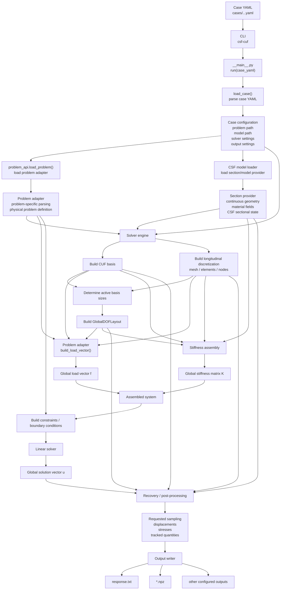

# End-to-end execution flow

This diagram shows the complete execution path from the case YAML to the generated result files.

## Key point

`GlobalDOFLayout` is built as soon as the discretization is fully known and is then shared by stiffness assembly, problem adapters, constraints, recovery, and any other numerical component that needs global DOF indexing.
