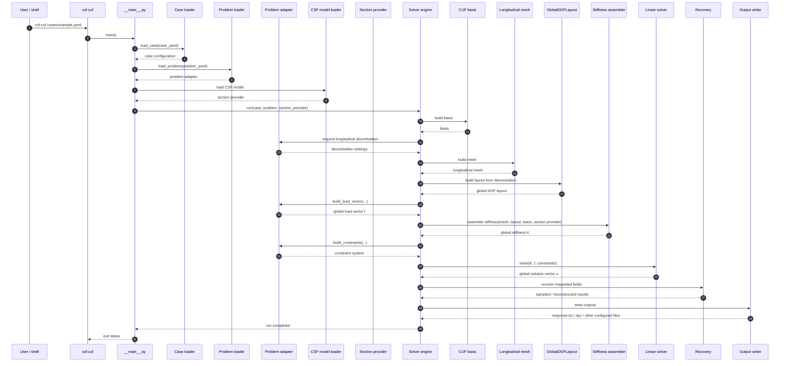

# Execution sequence

This sequence diagram shows the temporal order of the main operations in one CSF-CUF run.

```mermaid
sequenceDiagram
    autonumber

    participant U as User / shell
    participant CLI as csf-cuf
    participant MAIN as __main__.py
    participant CASE as Case loader
    participant PLOAD as Problem loader
    participant PAD as Problem adapter
    participant MODEL as CSF model loader
    participant SEC as Section provider
    participant ENG as Solver engine
    participant BASIS as CUF basis
    participant MESH as Longitudinal mesh
    participant DOF as GlobalDOFLayout
    participant ASM as Stiffness assembler
    participant SOLV as Linear solver
    participant REC as Recovery
    participant WR as Output writer

    U->>CLI: csf-cuf cases/example.yaml
    CLI->>MAIN: main()
    MAIN->>CASE: load_case(case_yaml)
    CASE-->>MAIN: case configuration

    MAIN->>PLOAD: load_problem(problem_yaml)
    PLOAD-->>MAIN: problem adapter

    MAIN->>MODEL: load CSF model
    MODEL-->>MAIN: section provider

    MAIN->>ENG: run(case, problem, section_provider)

    ENG->>BASIS: build basis
    BASIS-->>ENG: basis

    ENG->>PAD: request longitudinal discretization
    PAD-->>ENG: discretization settings

    ENG->>MESH: build mesh
    MESH-->>ENG: longitudinal mesh

    ENG->>DOF: build layout from discretization
    DOF-->>ENG: global DOF layout

    ENG->>PAD: build_load_vector(...)
    PAD-->>ENG: global load vector f

    ENG->>ASM: assemble stiffness(mesh, layout, basis, section provider)
    ASM-->>ENG: global stiffness K

    ENG->>PAD: build_constraints(...)
    PAD-->>ENG: constraint system

    ENG->>SOLV: solve(K, f, constraints)
    SOLV-->>ENG: global solution vector u

    ENG->>REC: recover requested fields
    REC-->>ENG: sampled / reconstructed results

    ENG->>WR: write outputs
    WR-->>ENG: response.txt / npz / other configured files

    ENG-->>MAIN: run completed
    MAIN-->>CLI: exit status
```
