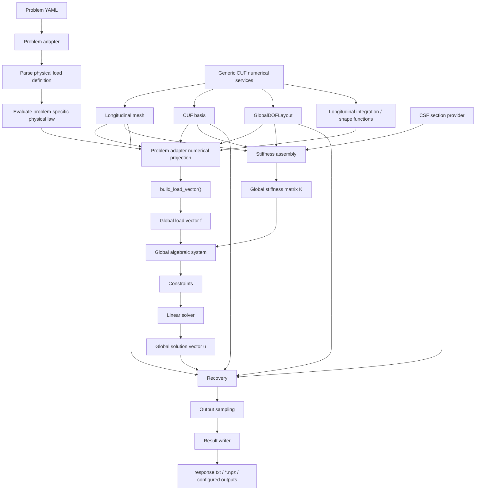

# Load path and solver boundary

This diagram focuses on the architectural boundary introduced for problem loads.



## Dependency direction

Correct dependency:

```text
problem adapter
    -> mesh
    -> basis
    -> GlobalDOFLayout
    -> generic integration / shape-function services
    -> global load vector
```

Forbidden dependency:

```text
CUF core
    -> PointLoad
    -> DistributedLoad
    -> TorqueLoad
    -> SurfaceTractionLoad
    -> any future physical load category
```

Adding a new physical load type must therefore require changes only in the problem-adapter layer, not in stiffness assembly or the numerical core.
