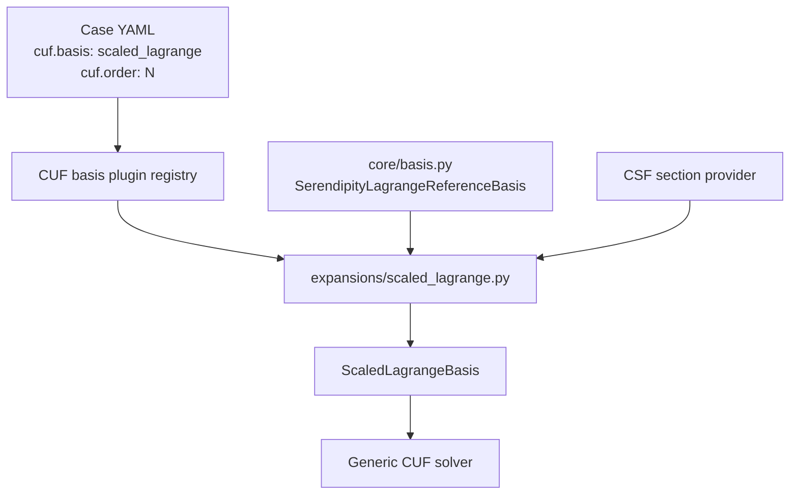

# Implementing the `scaled_lagrange` Expansion in CSF-CUF

## Purpose of this guide

This document is a practical implementation guide for a developer who wants to
understand, add, verify, and use the hierarchical `scaled_lagrange` transverse
expansion in CSF-CUF.

The important architectural point is simple:

> `scaled_lagrange` is an expansion plugin. It must not require a special branch
> in the generic CUF solver.

The plugin reuses the Serendipity-Lagrange reference hierarchy that already
exists in `core/basis.py`, maps that hierarchy to the physical transverse
coordinates, declares the quadrature information required by the solver, and
registers itself under the YAML name `scaled_lagrange`.

The implementation described here keeps the following boundaries unchanged:

- the CUF formulation is not modified;
- `solver/engine.py` does not gain an `if scaled_lagrange ...` branch;
- the KKT construction is not modified;
- existing YAML structure remains compatible;
- expansion-specific code stays in `cuf/expansions`;
- the meaning of every CUF index `tau` remains stable;
- code comments and YAML comments remain in English.

The hierarchy starts at N1. The validated series described in this document
covers N1 through N27.

---

## 1. Where `scaled_lagrange` fits in the architecture

A useful way to read the implementation is to separate what already belongs to
the CUF infrastructure from what belongs to this plugin.



The generic solver only works with the common CUF basis interface. It does not
need to know that the selected expansion is Lagrange, Legendre, Maclaurin, or
another future expansion.

For `scaled_lagrange`, the plugin has four jobs:

1. obtain the existing reference hierarchy;
2. convert physical coordinates `(y, z)` to reference coordinates `(xi, eta)`;
3. expose values, derivatives, optional polynomial coefficients, and quadrature
   requirements;
4. register the implementation under the YAML name `scaled_lagrange`.

This separation is what keeps the CUF core autonomous from the concrete
expansion.

---

## 2. Before writing the plugin: verify what already exists

Do **not** start by implementing Lagrange polynomials inside the new plugin.

The reference hierarchy already exists in:

```text
src/csf/cuf/core/basis.py
```

as:

```python
class SerendipityLagrangeReferenceBasis(CUFBasis):
```

`scaled_lagrange.py` must reuse that class rather than create a second
hierarchy.

### 2.1 Objects required from `core/basis.py`

| Object | Why the plugin needs it |
|---|---|
| `CUFBasis` | Common interface expected by the generic CUF solver |
| `SerendipityLagrangeReferenceBasis` | Complete hierarchical Serendipity-Lagrange basis on the reference square |

The reference basis provides:

| Member | Meaning |
|---|---|
| `order` | Requested hierarchy order `N` |
| `size` | Total number of functions present from orders 1 through `N` |
| `definition(tau)` | Stable identity of function `tau` |
| `value(tau, xi, eta)` | Value of a reference function |
| `derivative(tau, "y", xi, eta)` | Reference derivative with respect to `xi` |
| `derivative(tau, "z", xi, eta)` | Reference derivative with respect to `eta` |

The derivative labels remain `"y"` and `"z"` because
`SerendipityLagrangeReferenceBasis` implements the common `CUFBasis` interface.
Inside the reference basis, however, those arguments are the natural
coordinates `xi` and `eta`.

### 2.2 What `tau` means

The plugin must **not renumber** the hierarchy.

For every `tau`, the reference basis returns:

```python
kind, r, side, n, m = self.definition(tau)
```

The possible descriptors belong specifically to this
Serendipity-Lagrange hierarchy:

| `kind` | Meaning | Additional information |
|---|---|---|
| `I` | Four bilinear corner functions | `side=1..4` identifies the corner |
| `IIA` | Lower-order edge enrichment | `side=1..4` identifies the edge |
| `IIB` | Higher-order edge enrichment | `side=1..4` identifies the edge |
| `III` | Interior functions | `n` and `m` identify the polynomial orders |

Corner numbering is:

```text
1 -> (-1, -1)
2 -> (+1, -1)
3 -> (+1, +1)
4 -> (-1, +1)
```

Edge numbering is:

```text
1 -> eta = -1
2 -> xi  = +1
3 -> eta = +1
4 -> xi  = -1
```

For an interior function, the reference polynomial has the form
$`p_n(\xi)p_m(\eta)`$.

Examples of complete descriptors are:

```text
("I",   1, 2,    None, None)
("IIA", 3, 4,    None, None)
("IIB", 6, 1,    None, None)
("III", 6, None, 2,    4)
```

The practical consequence is important: `ScaledLagrangeBasis` inherits the
identity of every `tau` from `SerendipityLagrangeReferenceBasis`. It scales the
functions but does not create another numbering system.

### 2.3 Hierarchy size

For orders up to N3:

```math
M(N)=4N, \qquad N\leq3
```

For N4 and above:

```math
M(N)=4N+\frac{(N-2)(N-3)}{2}, \qquad N\geq4
```

Examples:

| Order | Functions |
|---:|---:|
| 1 | 4 |
| 2 | 8 |
| 3 | 12 |
| 4 | 17 |
| 5 | 23 |
| 6 | 30 |
| 10 | 68 |
| 27 | 408 |

### 2.4 What is deliberately *not* used

`core/basis.py` also contains:

```python
QuadrilateralSerendipityCUFBasis
```

That class is not used by this plugin.

`QuadrilateralSerendipityCUFBasis` performs a generic
reference-to-physical quadrilateral mapping. `scaled_lagrange` instead uses two
fixed global scales:

```math
\xi=\frac{y}{y_{\mathrm{scale}}},
\qquad
\eta=\frac{z}{z_{\mathrm{scale}}}
```

Do not replace the reference hierarchy with
`QuadrilateralSerendipityCUFBasis` when implementing this plugin.

### 2.5 Other infrastructure used by the plugin

| Object | Module | Role |
|---|---|---|
| `CUFBasisPlugin` | `csf.cuf.core.basis_plugins` | Describes an expansion plugin |
| `register_cuf_basis_plugin` | `csf.cuf.core.basis_plugins` | Registers the YAML name |
| `transverse_scales` | `csf.cuf.numerics` | Obtains `y_scale` and `z_scale` from the section provider |

The common expansion builder also receives the complete
`continuous_section_field`. This particular expansion does not need it because
its current definition uses fixed global transverse scales obtained from the
normalized section provider. The object is nevertheless available through the
general plugin contract for expansions that may need the complete CSF model.

### 2.6 Verify the existing reference basis

Run this before creating or changing `scaled_lagrange.py`:

```bash
python - <<'PY'
from csf.cuf.core.basis import (
    CUFBasis,
    SerendipityLagrangeReferenceBasis,
)

basis = SerendipityLagrangeReferenceBasis(4)

assert isinstance(basis, CUFBasis)
assert basis.order == 4
assert basis.size == 17

for tau in range(1, basis.size + 1):
    definition = basis.definition(tau)
    assert len(definition) == 5

    value = basis.value(tau, 0.25, -0.50)
    derivative_xi = basis.derivative(tau, "y", 0.25, -0.50)
    derivative_eta = basis.derivative(tau, "z", 0.25, -0.50)

    assert isinstance(float(value), float)
    assert isinstance(float(derivative_xi), float)
    assert isinstance(float(derivative_eta), float)

print("STEP 1 core reference basis: OK")
PY
```

If this succeeds, the reference hierarchy is already available. Do not modify
`core/basis.py` as part of the `scaled_lagrange` implementation.

---

## 3. Mathematical idea

The plugin converts physical transverse coordinates `(y, z)` into the natural
coordinates used by the reference hierarchy:

```math
\xi = \frac{y}{y_{\mathrm{scale}}},
\qquad
\eta = \frac{z}{z_{\mathrm{scale}}}
```

The reference basis lives on the square $`[-1,1]\times[-1,1]`$.

The CUF displacement expansion remains:

```math
\mathbf{u}(x,y,z)
=
\sum_{\tau=1}^{M}
F_\tau(y,z)\,\mathbf{u}_\tau(x)
```

The physical derivatives follow directly from the chain rule:

```math
F_{\tau,y}
=
\frac{1}{y_{\mathrm{scale}}}F_{\tau,\xi},
\qquad
F_{\tau,z}
=
\frac{1}{z_{\mathrm{scale}}}F_{\tau,\eta}
```

This is the whole scaling idea. The plugin does not alter the reference
hierarchy; it only evaluates it in scaled coordinates and converts its
derivatives back to physical coordinates.

---

## 4. Create the expansion module

Create:

```text
src/csf/cuf/expansions/scaled_lagrange.py
```

Do not rename or overwrite:

```text
scaled_lagrange_q1.py
```

The Q1 plugin remains a separate expansion.

The implementation below is complete: it contains the basis wrapper, option
validation, builder, power-coefficient export, quadrature declarations, and
plugin registration.

```python
# Version: CSF-CUF scaled hierarchical Lagrange expansion v2 - 2026-08-30
"""Scaled hierarchical Serendipity-Lagrange transverse expansion."""

import math
import numpy as np

from csf.cuf.core.basis import (
    CUFBasis,
    SerendipityLagrangeReferenceBasis,
)
from csf.cuf.core.basis_plugins import (
    CUFBasisPlugin,
    register_cuf_basis_plugin,
)
from csf.cuf.numerics import transverse_scales


# =============================================================================
# STEP 2
# Adapt the hierarchical reference basis to scaled physical coordinates
# =============================================================================

class ScaledLagrangeBasis(CUFBasis):
    """
    Hierarchical Serendipity-Lagrange basis in scaled coordinates.

    The physical coordinates are converted to reference coordinates as:

        xi  = y / y_scale
        eta = z / z_scale

    The underlying reference basis constructs the complete hierarchy
    associated with the requested order.
    """

    def __init__(
        self,
        *,
        order: int,
        y_scale: float,
        z_scale: float,
    ) -> None:
        """Construct the scaled hierarchical basis."""

        if not isinstance(order, int):
            raise TypeError(
                "scaled_lagrange order must be an integer"
            )

        if order < 1:
            raise ValueError(
                "scaled_lagrange order must be >= 1"
            )

        y_scale = float(y_scale)
        z_scale = float(z_scale)

        if not math.isfinite(y_scale) or y_scale <= 0.0:
            raise ValueError(
                "y_scale must be positive and finite"
            )

        if not math.isfinite(z_scale) or z_scale <= 0.0:
            raise ValueError(
                "z_scale must be positive and finite"
            )

        # This object owns the hierarchical term definitions,
        # reference values, and reference derivatives.
        self._reference_basis = (
            SerendipityLagrangeReferenceBasis(order)
        )

        self._y_scale = y_scale
        self._z_scale = z_scale

        # Build the physical-coordinate power representation once.  The
        # solver-side displacement checkpoint consumes this optional generic
        # representation without knowing which concrete expansion produced
        # it.  Future polynomial expansions may expose the same
        # power_coefficients() method to opt into self-contained displacement
        # checkpoints; the CUFBasis core contract remains unchanged.
        self._power_coefficients = self._build_power_coefficients()
        self._power_coefficients.setflags(write=False)

    @property
    def order(self) -> int:
        """Return the hierarchy order requested by the YAML file."""

        return self._reference_basis.order

    @property
    def size(self) -> int:
        """Return the total number of transverse expansion functions."""

        return self._reference_basis.size

    @property
    def scales(self) -> tuple[float, float]:
        """Return the fixed transverse coordinate scales."""

        return self._y_scale, self._z_scale

    def definition(self, tau: int):
        """Return the hierarchical definition associated with tau."""

        return self._reference_basis.definition(tau)

    def power_coefficients(self) -> np.ndarray:
        """Return F_tau coefficients in ascending physical powers of y and z.

        The returned array has shape ``(size, order + 1, order + 1)`` and
        follows

            F_tau(y,z) = sum_{p,q} coefficients[tau-1,p,q] y**p z**q.

        This optional expansion-owned export is used only to create a
        self-contained displacement checkpoint.  It is deliberately outside
        the CUFBasis core interface so future non-polynomial expansions can
        choose a different checkpoint representation without changing core.
        """

        return self._power_coefficients.copy()

    @staticmethod
    def _reference_polynomial(order: int, *, reverse: bool = False):
        """Return p_order(mu) or p_order(-mu) in ascending powers."""

        roots = np.linspace(-1.0, 1.0, int(order), dtype=float)
        coefficients = np.poly(roots)[::-1]
        if reverse:
            coefficients = coefficients * np.power(
                -1.0,
                np.arange(coefficients.size),
            )
        return np.asarray(coefficients, dtype=float)

    def _build_power_coefficients(self) -> np.ndarray:
        """Compile every hierarchy term into physical y,z power coefficients."""

        count = self.order + 1
        coefficients = np.zeros((self.size, count, count), dtype=float)

        for tau in range(1, self.size + 1):
            kind, r, side, n, m = self.definition(tau)

            if kind == "I":
                corner_signs = (
                    (-1.0, -1.0),
                    (+1.0, -1.0),
                    (+1.0, +1.0),
                    (-1.0, +1.0),
                )
                sign_y, sign_z = corner_signs[side - 1]
                reference = 0.25 * np.outer(
                    np.asarray((1.0, sign_y)),
                    np.asarray((1.0, sign_z)),
                )
            elif kind in ("IIA", "IIB"):
                if side == 1:
                    reference = 0.5 * np.outer(
                        self._reference_polynomial(r),
                        np.asarray((1.0, -1.0)),
                    )
                elif side == 2:
                    reference = 0.5 * np.outer(
                        np.asarray((1.0, +1.0)),
                        self._reference_polynomial(r),
                    )
                elif side == 3:
                    reference = 0.5 * np.outer(
                        self._reference_polynomial(r, reverse=True),
                        np.asarray((1.0, +1.0)),
                    )
                elif side == 4:
                    reference = 0.5 * np.outer(
                        np.asarray((1.0, -1.0)),
                        self._reference_polynomial(r, reverse=True),
                    )
                else:
                    raise RuntimeError("invalid SL edge index")
            elif kind == "III":
                reference = np.outer(
                    self._reference_polynomial(n),
                    self._reference_polynomial(m),
                )
            else:
                raise RuntimeError(
                    f"unsupported SL function type {kind!r}"
                )

            rows, columns = reference.shape
            y_scaling = np.power(
                self._y_scale,
                -np.arange(rows, dtype=float),
            )
            z_scaling = np.power(
                self._z_scale,
                -np.arange(columns, dtype=float),
            )
            coefficients[tau - 1, :rows, :columns] = (
                reference
                * y_scaling[:, None]
                * z_scaling[None, :]
            )

        return coefficients

    def value(
        self,
        tau: int,
        y: float,
        z: float,
        *,
        x: float | None = None,
    ) -> float:
        """
        Evaluate one basis function at physical coordinates.

        The current expansion uses fixed global scales and therefore
        does not depend explicitly on x.
        """

        xi = float(y) / self._y_scale
        eta = float(z) / self._z_scale

        return float(
            self._reference_basis.value(
                tau,
                xi,
                eta,
            )
        )

    def derivative(
        self,
        tau: int,
        direction: str,
        y: float,
        z: float,
        *,
        x: float | None = None,
    ) -> float:
        """
        Evaluate one physical transverse derivative.

        The reference derivatives are converted through:

            d/dy = (1/y_scale) d/dxi
            d/dz = (1/z_scale) d/deta
        """

        xi = float(y) / self._y_scale
        eta = float(z) / self._z_scale

        if direction == "y":
            derivative_xi = (
                self._reference_basis.derivative(
                    tau,
                    "y",
                    xi,
                    eta,
                )
            )

            return float(
                derivative_xi / self._y_scale
            )

        if direction == "z":
            derivative_eta = (
                self._reference_basis.derivative(
                    tau,
                    "z",
                    xi,
                    eta,
                )
            )

            return float(
                derivative_eta / self._z_scale
            )

        raise ValueError(
            "direction must be 'y' or 'z'"
        )


# =============================================================================
# STEP 3
# Validate expansion-specific YAML options
# =============================================================================

def _reject_options(options):
    """
    Reject unsupported cuf.basis_options.

    The expansion obtains its transverse scales directly from the CSF
    geometry and currently requires no expansion-specific parameters.
    """

    if options:
        raise ValueError(
            "scaled_lagrange does not accept "
            "cuf.basis_options; "
            f"received {sorted(options)}"
        )


# =============================================================================
# STEP 4
# Build the basis selected by the YAML file
# =============================================================================

def _build(*, order, section_provider, continuous_section_field, options):
    """
    Construct a complete ScaledLagrangeBasis instance.

    The generic plugin contract provides both ``section_provider`` and
    ``continuous_section_field``. This expansion uses the normalized
    ``section_provider`` only to obtain fixed transverse scales and does not
    otherwise depend on the current section state. The complete
    ``continuous_section_field`` is therefore intentionally unused here.
    """

    del continuous_section_field  # Available by contract; unused here.

    # No expansion-specific YAML options are currently supported.
    _reject_options(options)

    # The hierarchy starts at order one.
    if not isinstance(order, int):
        raise TypeError(
            "scaled_lagrange order must be an integer"
        )

    if order < 1:
        raise ValueError(
            "scaled_lagrange order must be >= 1"
        )

    # Obtain fixed global scales through the normalized CSF section interface.
    y_scale, z_scale = transverse_scales(
        section_provider
    )

    return ScaledLagrangeBasis(
        order=order,
        y_scale=y_scale,
        z_scale=z_scale,
    )


# =============================================================================
# STEP 5
# Declare the minimum sectional quadrature order
# =============================================================================

def _section_gauss_minimum(basis):
    """
    Return a conservative sectional Gauss order.

    At hierarchy order N, the edge functions may contain a polynomial
    of degree N multiplied by a transverse linear factor.

    Products of two basis functions can therefore reach total degree:

        2 * (N + 1)

    During polygon slicing, the affine integration bounds may add one
    further degree to the outer one-dimensional integrand.

    An (N + 2)-point Gauss-Legendre rule is exact through degree:

        2 * (N + 2) - 1 = 2*N + 3

    The selected rule is therefore conservative for the polynomial
    products used by the sectional CUF nuclei.
    """

    if not isinstance(basis, ScaledLagrangeBasis):
        raise TypeError(
            "scaled_lagrange received an incompatible basis"
        )

    return int(basis.order) + 2


# =============================================================================
# STEP 6
# Declare the transverse contribution to longitudinal quadrature
# =============================================================================

def _longitudinal_transverse_degree(basis):
    """
    Return the conservative longitudinal degree contribution.

    An edge function of hierarchy order N can contain a polynomial
    contribution of total degree N + 1 in the transverse coordinates.

    If the physical transverse coordinates vary affinely along x,
    one basis function may therefore acquire longitudinal degree N + 1.

    A product of two basis functions may reach:

        2 * (N + 1)

    This contribution is combined by the solver with the independent
    geometry, material, and longitudinal finite-element contributions.
    """

    if not isinstance(basis, ScaledLagrangeBasis):
        raise TypeError(
            "scaled_lagrange received an incompatible basis"
        )

    return 2 * (int(basis.order) + 1)


# =============================================================================
# STEP 7
# Register the expansion
# =============================================================================

register_cuf_basis_plugin(
    CUFBasisPlugin(
        # This exact identifier is used in the YAML file.
        name="scaled_lagrange",

        # Construct the concrete scaled hierarchy.
        builder=_build,

        # Declare the minimum sectional integration order.
        section_gauss_minimum=_section_gauss_minimum,

        # Declare the longitudinal polynomial-degree contribution.
        longitudinal_transverse_degree=(
            _longitudinal_transverse_degree
        ),
    )
)

```

---

## 5. How to read the module

The source is easier to understand if it is read by responsibility rather than
line by line.

| Part | Responsibility |
|---|---|
| `ScaledLagrangeBasis` | Adapts the existing reference hierarchy to physical scaled coordinates |
| `_reject_options()` | Rejects unsupported expansion-specific YAML options |
| `_build()` | Creates the concrete basis requested by the YAML case |
| `_section_gauss_minimum()` | Declares the minimum sectional quadrature order |
| `_longitudinal_transverse_degree()` | Declares the transverse contribution to the longitudinal polynomial degree estimate |
| `register_cuf_basis_plugin(...)` | Makes `scaled_lagrange` discoverable by name |

### 5.1 `ScaledLagrangeBasis`

The class owns a `SerendipityLagrangeReferenceBasis` instance:

```python
self._reference_basis = SerendipityLagrangeReferenceBasis(order)
```

Therefore:

- `order` comes from the reference hierarchy;
- `size` comes from the reference hierarchy;
- `definition(tau)` comes from the reference hierarchy;
- `tau` numbering remains unchanged.

When `value()` is called, physical coordinates are scaled first:

```python
xi = float(y) / self._y_scale
eta = float(z) / self._z_scale
```

and the reference function is then evaluated at `(xi, eta)`.

When `derivative()` is called, the reference derivative is converted by the
appropriate scale factor.

### 5.2 Power coefficients

The class also builds an optional polynomial representation:

```math
F_\tau(y,z)
=
\sum_{p,q} C_{\tau pq} y^p z^q
```

This representation is built once in `__init__`, stored read-only internally,
and returned as a copy by `power_coefficients()`.

It is not part of the mandatory `CUFBasis` contract. It is an
expansion-specific optional export used by the displacement checkpoint
machinery. This keeps non-polynomial future expansions free to use another
representation.

### 5.3 Builder and YAML options

The builder receives:

```text
order
section_provider
continuous_section_field
options
```

`scaled_lagrange` currently uses `section_provider` to obtain fixed transverse
scales and deliberately does not use `continuous_section_field` beyond
receiving it through the common contract.

No expansion-specific `cuf.basis_options` are currently accepted.

### 5.4 Section quadrature declaration

For hierarchy order `N`, the plugin returns:

```python
N + 2
```

as its conservative minimum sectional Gauss order.

The reasoning encoded in the source is that edge functions may reach degree
`N + 1`, products may reach degree `2(N + 1)`, and polygon slicing can add one
further degree to the outer one-dimensional integrand.

### 5.5 Longitudinal quadrature contribution

The plugin reports:

```python
2 * (N + 1)
```

as the transverse contribution to the longitudinal polynomial-degree estimate.

This value is then combined by the generic solver with the independent
geometry, material, and longitudinal finite-element contributions.

### 5.6 Registration

The final registration:

```python
register_cuf_basis_plugin(
    CUFBasisPlugin(
        name="scaled_lagrange",
        ...
    )
)
```

is what connects the YAML name to the implementation.

The solver itself does not need a special `scaled_lagrange` branch.

---

## 6. Verify syntax and plugin discovery

First check the module itself:

```bash
python -m py_compile src/csf/cuf/expansions/scaled_lagrange.py
```

Then verify discovery:

```bash
python -c "from csf.cuf.core.basis_plugins import available_cuf_basis_plugins; print(available_cuf_basis_plugins())"
```

The output must contain:

```text
scaled_lagrange
```

When the registry automatically discovers modules below
`csf.cuf.expansions`, no additional import is required in
`expansions/__init__.py`.

---

## 7. Using the expansion from YAML

Once the plugin is registered, using it does not require Python changes. Select
it in the case YAML.

Example N6 case:

```yaml
# Version: CSF-CUF scaled hierarchical Lagrange case v1 - 2026-08-29
case:
  name: cuf_scaled_lagrange_taper40_deg20_table10_N06

problem:
  yaml: ../../../../problems/taper40_deg20_table10.yaml
  adapter: ../../../../validation/carrera_problem.py

cuf:
  basis: scaled_lagrange
  order: 6

longitudinal:
  method: finite_element
  elements: 1
  order: 6

section_integration:
  method: fixed_gauss_polygon
  gauss_order: 6

sampling:
  stations:
    - 0.00
    - 0.25
    - 0.50
    - 0.75
    - 1.00
  displacement_samples: 201
  stress_grid: 31

output:
  adapter: ../../../../validation/carrera_post.py
  directory: ../../../../output/taper40_deg20_scaled_lagrange/table10_N06
```

For an N1-N27 campaign, the original guide changes only:

- `case.name`;
- `cuf.order`;
- `output.directory`.

The plugin architecture therefore separates *implementing an expansion* from
*using an expansion*: after registration, the user selects it through YAML.

---

## 8. Displacement checkpoint support

`ScaledLagrangeBasis` can export every transverse function as physical
polynomial coefficients:

```math
F_\tau(y,z)
=
\sum_{p,q} C_{\tau pq} y^p z^q
```

The public method is:

```python
def power_coefficients(self) -> np.ndarray:
    return self._power_coefficients.copy()
```

The solver may use this optional representation after the KKT solve to create a
self-contained displacement checkpoint:

```text
<case.name>.cuf.npz
```

At a fixed longitudinal coordinate `x`, the solved CUF amplitudes and the
transverse polynomial coefficients can then be contracted to evaluate
$`u_x(y,z)`$, $`u_y(y,z)`$, and $`u_z(y,z)`$.

---

## 9. Verification tests

Run the following tests only after Sections 2, 4 and 6 succeed. Each test
imports the `ScaledLagrangeBasis` created in Section 4; none of them defines a
second implementation.

## 9.1 Hierarchy, size, and finite values

```python
import math

from csf.cuf.expansions.scaled_lagrange import (
    ScaledLagrangeBasis,
)


def expected_size(order):
    if order <= 3:
        return 4 * order

    return (
        4 * order
        + (order - 2) * (order - 3) // 2
    )


orders_to_test = (
    1,
    2,
    3,
    4,
    5,
    10,
    17,
    27,
)

test_points = (
    (0.0, 0.0),
    (0.25, -0.50),
    (-0.75, 0.80),
)


for order in orders_to_test:
    basis = ScaledLagrangeBasis(
        order=order,
        y_scale=2.0,
        z_scale=3.0,
    )

    assert basis.order == order
    assert basis.size == expected_size(order)

    for tau in range(1, basis.size + 1):
        for y, z in test_points:
            value = basis.value(tau, y, z)
            derivative_y = basis.derivative(
                tau,
                "y",
                y,
                z,
            )
            derivative_z = basis.derivative(
                tau,
                "z",
                y,
                z,
            )

            assert math.isfinite(value)
            assert math.isfinite(derivative_y)
            assert math.isfinite(derivative_z)


print("scaled_lagrange hierarchy test: PASSED")
```

## 9.2 Q1 Kronecker property

```python
from csf.cuf.expansions.scaled_lagrange import (
    ScaledLagrangeBasis,
)


basis = ScaledLagrangeBasis(
    order=1,
    y_scale=2.0,
    z_scale=3.0,
)

physical_corners = (
    (-2.0, -3.0),
    (+2.0, -3.0),
    (+2.0, +3.0),
    (-2.0, +3.0),
)

tolerance = 1.0e-14

for corner_index, (y, z) in enumerate(
    physical_corners,
    start=1,
):
    values = [
        basis.value(tau, y, z)
        for tau in range(1, basis.size + 1)
    ]

    expected = [
        1.0 if tau == corner_index else 0.0
        for tau in range(1, basis.size + 1)
    ]

    for computed, reference in zip(values, expected):
        assert abs(computed - reference) <= tolerance


print("scaled_lagrange Q1 Kronecker test: PASSED")
```

## 9.3 Hierarchical prefix stability

Every function already present at order N must retain the same definition,
value, derivative, and `tau` index at order N+1.

```python
from csf.cuf.expansions.scaled_lagrange import (
    ScaledLagrangeBasis,
)


test_points = (
    (0.0, 0.0),
    (0.25, -0.50),
    (-0.75, 0.80),
)

for order in range(1, 10):
    lower = ScaledLagrangeBasis(
        order=order,
        y_scale=2.0,
        z_scale=3.0,
    )

    higher = ScaledLagrangeBasis(
        order=order + 1,
        y_scale=2.0,
        z_scale=3.0,
    )

    for tau in range(1, lower.size + 1):
        assert lower.definition(tau) == higher.definition(tau)

        for y, z in test_points:
            assert (
                lower.value(tau, y, z)
                == higher.value(tau, y, z)
            )
            assert (
                lower.derivative(tau, "y", y, z)
                == higher.derivative(tau, "y", y, z)
            )
            assert (
                lower.derivative(tau, "z", y, z)
                == higher.derivative(tau, "z", y, z)
            )


print("scaled_lagrange hierarchy stability test: PASSED")
```

## 9.4 Analytical derivatives versus finite differences

```python
from csf.cuf.expansions.scaled_lagrange import (
    ScaledLagrangeBasis,
)


orders_to_test = (1, 2, 3, 5, 10, 27)
test_points = (
    (0.0, 0.0),
    (0.25, -0.50),
    (-0.75, 0.80),
)

step = 1.0e-6
absolute_tolerance = 1.0e-8
relative_tolerance = 1.0e-6


for order in orders_to_test:
    basis = ScaledLagrangeBasis(
        order=order,
        y_scale=2.0,
        z_scale=3.0,
    )

    for tau in range(1, basis.size + 1):
        for y, z in test_points:
            analytical_y = basis.derivative(
                tau,
                "y",
                y,
                z,
            )
            finite_difference_y = (
                basis.value(tau, y + step, z)
                - basis.value(tau, y - step, z)
            ) / (2.0 * step)

            analytical_z = basis.derivative(
                tau,
                "z",
                y,
                z,
            )
            finite_difference_z = (
                basis.value(tau, y, z + step)
                - basis.value(tau, y, z - step)
            ) / (2.0 * step)

            error_y = abs(analytical_y - finite_difference_y)
            error_z = abs(analytical_z - finite_difference_z)

            tolerance_y = (
                absolute_tolerance
                + relative_tolerance
                * max(
                    abs(analytical_y),
                    abs(finite_difference_y),
                )
            )
            tolerance_z = (
                absolute_tolerance
                + relative_tolerance
                * max(
                    abs(analytical_z),
                    abs(finite_difference_z),
                )
            )

            assert error_y <= tolerance_y
            assert error_z <= tolerance_z


print("scaled_lagrange derivative test: PASSED")
```

## 9.5 Exact N1 equivalence with `scaled_lagrange_q1`

```python
from csf.cuf.expansions.scaled_lagrange import (
    ScaledLagrangeBasis,
)
from csf.cuf.expansions.scaled_lagrange_q1 import (
    ScaledLagrangeQ1Basis,
)


hierarchical = ScaledLagrangeBasis(
    order=1,
    y_scale=2.0,
    z_scale=3.0,
)

q1 = ScaledLagrangeQ1Basis(
    y_scale=2.0,
    z_scale=3.0,
)

test_points = (
    (-2.0, -3.0),
    (+2.0, -3.0),
    (+2.0, +3.0),
    (-2.0, +3.0),
    (0.0, 0.0),
    (0.25, -0.50),
    (-0.75, 0.80),
)

assert hierarchical.size == q1.size == 4

for tau in range(1, 5):
    for y, z in test_points:
        assert (
            hierarchical.value(tau, y, z)
            == q1.value(tau, y, z)
        )
        assert (
            hierarchical.derivative(tau, "y", y, z)
            == q1.derivative(tau, "y", y, z)
        )
        assert (
            hierarchical.derivative(tau, "z", y, z)
            == q1.derivative(tau, "z", y, z)
        )


print(
    "scaled_lagrange N1 versus "
    "scaled_lagrange_q1: EXACT EQUALITY"
)
```

## 9.6 Power-coefficient export

```python
import numpy as np

from csf.cuf.expansions.scaled_lagrange import (
    ScaledLagrangeBasis,
)


for order in (1, 2, 3, 4, 6, 10, 27):
    basis = ScaledLagrangeBasis(
        order=order,
        y_scale=33.333,
        z_scale=75.0,
    )
    coefficients = basis.power_coefficients()

    for y, z in (
        (0.0, 0.0),
        (12.5, -31.25),
        (-33.0, 74.0),
    ):
        y_powers = np.power(
            y,
            np.arange(coefficients.shape[1]),
        )
        z_powers = np.power(
            z,
            np.arange(coefficients.shape[2]),
        )

        exported = np.einsum(
            "tpq,p,q->t",
            coefficients,
            y_powers,
            z_powers,
            optimize=True,
        )

        scalar = np.asarray(
            [
                basis.value(tau, y, z)
                for tau in range(1, basis.size + 1)
            ],
            dtype=float,
        )

        np.testing.assert_allclose(
            exported,
            scalar,
            rtol=1.0e-10,
            atol=1.0e-12,
        )


print("scaled_lagrange power export test: PASSED")
```

## 9.7 Compiled displacement checkpoint round-trip

```python
from pathlib import Path

import numpy as np

from csf.cuf.expansions.scaled_lagrange import (
    ScaledLagrangeBasis,
)
from csf.cuf.solver.assembly import GlobalDOFLayout
from csf.cuf.solver.compiled_field import (
    CompiledDisplacementField,
)
from csf.cuf.solver.longitudinal import (
    LongitudinalElement1D,
    LongitudinalMesh1D,
)


element = LongitudinalElement1D(
    index=0,
    node_ids=tuple(range(7)),
    coordinates=tuple(np.linspace(0.0, 1000.0, 7)),
)

mesh = LongitudinalMesh1D(
    x_start=0.0,
    x_end=1000.0,
    nodes=element.coordinates,
    elements=(element,),
    order=6,
)

basis = ScaledLagrangeBasis(
    order=6,
    y_scale=33.333,
    z_scale=75.0,
)

layout = GlobalDOFLayout(
    number_of_nodes=7,
    basis_size=basis.size,
)

solved_dofs = np.random.default_rng(20260829).normal(
    size=layout.total_dofs
)

field = CompiledDisplacementField.from_solution_data(
    mesh=mesh,
    dof_layout=layout,
    solved_dofs=solved_dofs,
    basis=basis,
    metadata={"case_name": "roundtrip"},
)

path, digest = field.save_atomic(
    Path("roundtrip.cuf.npz")
)

loaded = CompiledDisplacementField.load(path)

for point in (
    (0.0, 0.0, 0.0),
    (530.0, 33.0, -64.4),
    (1000.0, -33.0, 30.0),
):
    np.testing.assert_array_equal(
        loaded(*point),
        field(*point),
    )


print("checkpoint SHA256:", digest)
print("compiled displacement round-trip: PASSED")
```

## 10. Full solver regression

Run `scaled_lagrange_q1` N1 and `scaled_lagrange` N1 with identical problem,
geometry, longitudinal discretization, quadrature, loads, constraints, and
sampling.


The validated N1 comparison produced exact equality of:

- `M=4`;
- `DOFs=84`;
- effective sectional Gauss order `6`;
- longitudinal degree estimate `19`;
- effective longitudinal Gauss order `10`;
- KKT shape `(101,101)`;
- KKT `nnz=7144`;
- residual mean and standard deviation;
- KKT structure, KKT data, and RHS hashes.

Validated hashes:

```text
indptr  = 373e66685f86612ba35a5a5b6a4c0d3682891cb201cd7e1aa1d9acb23df088b3
indices = b010c3f4a0a2574b4a560b8dbaee66c1945fd7d2639e427047c27a01ab0d98e9
data    = 171b1966c2700562e40e31c0979c5735f52463fc39fcd4f4a194275e34251e9a
rhs     = afcbb97af98435b02400c19f21e0edc9ab42a449a5e5d11687e155364ae1635f
```

The only acceptable log differences are case name, output directory, and
elapsed time.

## 11. Convergence campaign N1-N27

For every order, retain:

- unchanged YAML input;
- complete log;
- effective sectional and longitudinal Gauss orders;
- basis size and DOF count;
- KKT shape and `nnz`;
- constraint rank;
- original and equilibrated reciprocal condition estimates;
- KKT and RHS hashes;
- residual statistics;
- maximum displacements and locations;
- generated `<case.name>.cuf.npz` checkpoint;
- post-processing elapsed time.

Do not compare `scaled_lagrange` N with Legendre or Maclaurin N as if the bases
were algebraically identical. Use consecutive Lagrange orders to assess
hierarchical convergence, and use independent analytical or FEM references to
assess physical accuracy.

## 12. Completion checklist

- [ ] `scaled_lagrange.py` compiles.
- [ ] Plugin discovery lists `scaled_lagrange`.
- [ ] Orders N1-N27 construct finite functions and derivatives.
- [ ] Hierarchical prefix ordering is stable.
- [ ] Analytical derivatives pass finite-difference checks.
- [ ] N1 is exactly equal to `scaled_lagrange_q1`.
- [ ] N1 KKT and RHS hashes match the Q1 baseline.
- [ ] Section and longitudinal quadrature convergence are verified.
- [ ] Constraint matrices retain full numerical rank.
- [ ] Equilibrated KKT solves have acceptable residuals.
- [ ] Checkpoint save/load reproduces displacement queries.
- [ ] Consecutive N results demonstrate convergence.
- [ ] No expansion-specific branch is added to the CUF solver core.

