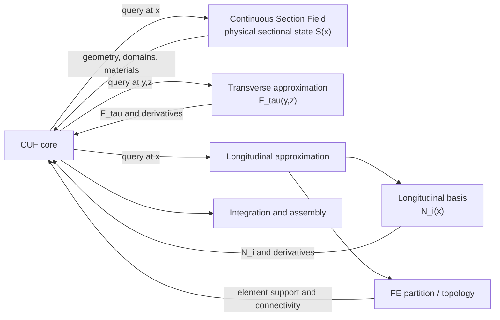

# Inside the CSF-CUF

> [CSF–CUF tutorial: non-prismatic variable-material T-section](https://github.com/giovanniboscu/continuous-section-field/blob/main/cuf/tutorials/variable_material_t_section/README.md)
>
> The solver implements the Carrera Unified Formulation (CUF), with CSF (Continuous Section Field) providing the continuous field description of the cross-section geometry and material properties along the structural member.

This repository currently focuses on **single one-dimensional beam members**. General assemblies of multiple connected members are outside the present implementation scope.

The implementation of CSF–CUF is based on a simple guiding idea: the numerical solver should not contain the physical description of the structure or embed a particular approximation family.

Instead, the solver should request the physical and numerical information it needs from independent descriptions, at the position where that information is required.

This changes the direction in which the model is constructed. Geometry and material are not reduced in advance to a set of solver-specific sectional properties. They remain part of an independent physical description, represented by the Continuous Section Field (CSF), which the CUF formulation queries during assembly.

The same principle is applied to the numerical approximations.

The transverse expansion law is not embedded in the CUF core, but is supplied through an independent transverse basis.

Likewise, the longitudinal approximation is kept distinct from the finite-element partition itself. The subdivision of the beam into longitudinal elements determines the numerical topology, while the longitudinal basis determines how the solution is represented inside those elements.

The solver therefore operates on independent descriptions of:

* the physical sectional state;
* the transverse approximation;
* the longitudinal approximation;
* the longitudinal discretization.

The CUF core combines the information supplied by these components according to the formulation without containing the definition of any particular geometry, material distribution, transverse expansion family, or longitudinal approximation family.

This separation is the main architectural principle behind the implementation.

The architecture is therefore not a sequential transformation from geometry to a CUF model.

The CUF core combines several independent descriptions when the corresponding information is required:

* the **Continuous Section Field** describes the physical member;
* the **transverse expansion** describes the admissible cross-sectional kinematics;
* the **longitudinal basis** describes the approximation along the beam axis;
* the **finite-element topology** describes how the longitudinal domain is partitioned and connected.

The distinction between the last two is important.

The finite-element discretization determines **where the longitudinal elements are**, while the longitudinal basis determines **how the field is approximated inside each element**.

They are therefore related, but they are not the same object.

The objective is to preserve the CUF formulation while allowing the physical description and the approximation choices to evolve independently around it.

---

> [CSF–CUF quick start: prismatic rectangular beam](https://github.com/giovanniboscu/continuous-section-field/tree/main/cuf/quickstart)
>
> Minimal runnable example showing the basic CSF–CUF workflow with a prismatic rectangular section, a predefined torsion problem, and a basic CUF case.

---

## Why use CUF?

For many structural problems, a three-dimensional finite element model is the most immediate and established choice.

CUF follows a different philosophy: rather than relying primarily on spatial discretization, it requires the analyst to explicitly choose how the structural response is represented over the cross-section.

This additional freedom is one of CUF's main strengths, but also one of the main barriers to its practical use. Without an existing infrastructure, applying CUF to a new problem may first require developing and validating the numerical model itself.

CSF–CUF was created to reduce this barrier without hiding the modelling choices that define the CUF approach.

This repository provides a general-purpose framework for building and running beam models based on the Carrera Unified Formulation.

An analysis is composed from independent external descriptions of the physical model, the structural problem, and the numerical case.

Geometry and material properties are supplied by the Continuous Section Field, which acts as a general section provider along the beam axis. During assembly, the CUF solver queries this continuous description at the current longitudinal position.

Variable cross-sections are therefore represented directly through their physical sectional state, rather than by embedding a particular reference-to-physical coordinate mapping in the CUF solver. The longitudinal variation of geometry and material belongs to the sectional description, while the CUF formulation operates on the physical section made available at each position.

The CUF core is consequently independent of the specific section geometry and material distribution.

Likewise, transverse expansion laws are treated as interchangeable components through a common interface. Different CUF approximation families can therefore be introduced without modifying the solver core.

The same separation is applied in the longitudinal direction.

The finite-element partition defines the subdivision and connectivity of the beam domain, while the longitudinal basis defines the approximation used within that discretization. The approximation law is therefore not identified with the finite-element topology itself.

At the architectural level, the framework keeps five aspects distinct:

* the physical description of geometry and materials;
* the transverse expansion law;
* the longitudinal approximation law;
* the longitudinal finite-element discretization;
* the CUF numerical formulation.

These components cooperate during assembly, but none of them is intended to define the others.

The objective is not to implement a CUF model tailored to a particular benchmark, geometry, transverse expansion, or longitudinal approximation family, but to provide a reusable framework in which these choices remain explicit and can evolve independently.

In practice, users can change the physical model, material distribution, transverse approximation, or longitudinal numerical representation without embedding those choices in the CUF solver core.

## An open implementation

This repository is open for a reason: it is meant to be explored, questioned, tested, and challenged.

If you are a student, a researcher, or simply curious about how and why the method works, use it, experiment with it, and ask questions.

The goal is not to impose a way of doing things, but to propose one. If something is unclear, if you think something could be improved, or if you have an idea for a different implementation, that is exactly the kind of interaction this project is meant to encourage.

> **Note:** For a general description of the CSF–CUF architecture, formulation, and solver workflow, see the [CUF solver documentation](https://github.com/giovanniboscu/continuous-section-field/blob/main/docs/cuf/readme.md).

### Mathematical Formulation of the CSF–CUF Coupling

* [Formulation for Directly Prescribed Variable Sections](https://github.com/giovanniboscu/continuous-section-field/blob/main/docs/model/csf_cuf_formal_variable_section_extension.md)
* [CUF displacement expansion for CSF coupling](https://github.com/giovanniboscu/continuous-section-field/blob/main/docs/model/csf_cuf_displacement_expansionf_coupling.md)
* [Numerical validation against Carrera & Giunta](https://github.com/giovanniboscu/continuous-section-field/blob/main/docs/model/csf_cuf_numerical_validation_carrera_giunta.md)
* [CSF–CUF sectional constitutive interface](https://github.com/giovanniboscu/continuous-section-field/blob/main/docs/model/csf_cuf_sectional_constitutive_interface.md)

### References

* E. Carrera, G. Giunta, **“Refined Beam Theories Based on a Unified Formulation”**, *International Journal of Applied Mechanics*, 2(1) (2010), 117–143. [DOI](https://doi.org/10.1142/S1758825110000500).

* G. Giunta, S. Belouettar, E. Carrera, **“Analysis of FGM Beams by Means of Classical and Advanced Theories”**, *Mechanics of Advanced Materials and Structures*, 17 (2010), 622-635.

* S. O. Ojo, P. M. Weaver, **“Efficient strong Unified Formulation for stress analysis of non-prismatic beam structures”**, 2021.
