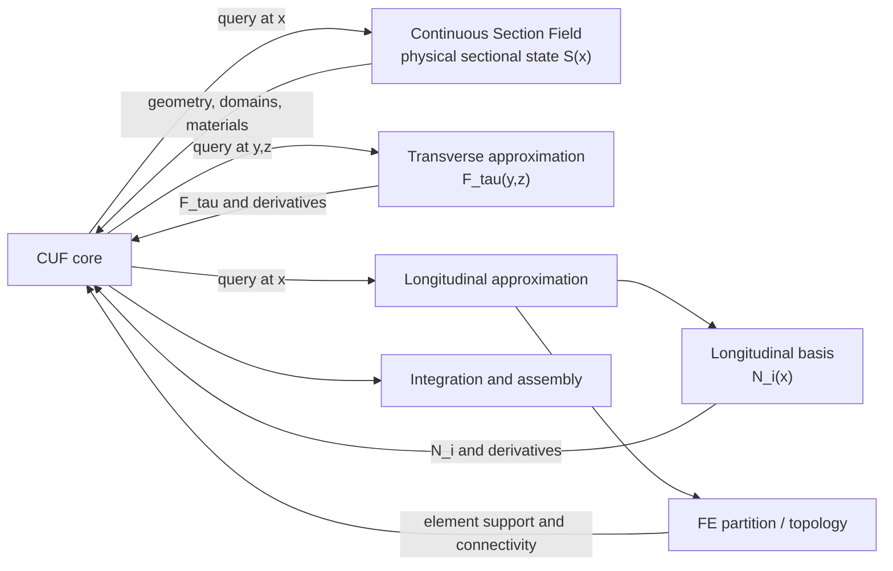

# Inside the CSF-CUF

> [I-Shape - Prismatic and Tapered Beam Comparison](https://github.com/giovanniboscu/continuous-section-field/blob/main/cuf/I-Shape/readme.md)  
> Numerical validation case comparing CSF-CUF and 3D FEM solutions for both prismatic and continuously tapered I-shaped beams, using the same CUF formulation and solver settings while changing only the continuous cross-section geometry.

>
> [CSF–CUF tutorial: non-prismatic variable-material T-section](https://github.com/giovanniboscu/continuous-section-field/blob/main/cuf/tutorials/variable_material_t_section/README.md)  
> Step-by-step tutorial showing how CSF describes continuously varying geometry and material properties and how these fields are used directly by the CUF solver for a non-prismatic T-section beam.
>
> The solver implements the Carrera Unified Formulation (CUF), with CSF (Continuous Section Field) providing the continuous field description of the cross-section geometry and material properties along the structural member.

The implementation of CSF–CUF starts from a fundamental choice: **the beam cross-section is treated as a first-class object**, rather than being reduced in advance to a set of sectional properties or incorporated into a case-specific mathematical formulation.

Through the Continuous Section Field (CSF), geometry and material properties remain explicitly defined and accessible at any position along the beam. The CUF formulation can therefore evaluate the physical quantities it requires directly, wherever they are needed.

This approach removes the need to derive and symbolically integrate case-specific sectional expressions. The formulation remains unchanged, while the sectional contributions are evaluated numerically from the physical description.

As a consequence, geometry, material description, transverse CUF expansion, and longitudinal finite-element approximation can evolve independently, without requiring modifications to the core formulation.

The same principle is applied to the numerical approximations.

The transverse expansion law is not embedded in the CUF core, but is supplied through an independent transverse basis.

Likewise, the longitudinal approximation is kept distinct from the finite-element partition itself. The subdivision of the beam into longitudinal elements determines the numerical topology, while the longitudinal basis determines how the solution is represented inside those elements.

The solver therefore operates on independent descriptions of:

* the physical sectional state;
* the transverse approximation;
* the longitudinal approximation;
* the longitudinal discretization.

```mermaid
flowchart LR
    CUF["CUF core"]

    CSF["Continuous Section Field<br/>physical sectional state S(x)"]

    TEXP["Transverse approximation<br/>F_tau(y,z)"]

    LONG["Longitudinal approximation"]
    LBASIS["Longitudinal basis<br/>N_i(x)"]
    FETOP["FE partition / topology"]

    LONG --> LBASIS
    LONG --> FETOP

    CUF -->|"query at x"| CSF
    CSF -->|"geometry, domains, materials"| CUF

    CUF -->|"query at y,z"| TEXP
    TEXP -->|"F_tau and derivatives"| CUF

    CUF -->|"query at x"| LONG
    LBASIS -->|"N_i and derivatives"| CUF
    FETOP -->|"element support and connectivity"| CUF

    CUF --> ASM["Integration and assembly"]
```

The architecture is therefore not a sequential transformation from geometry to a CUF model.

The CUF core combines several independent descriptions when the corresponding information is required:

* the **Continuous Section Field** describes the physical member;
* the **transverse expansion** describes the admissible cross-sectional kinematics;
* the **longitudinal basis** describes the approximation along the beam axis;
* the **finite-element topology** describes how the longitudinal domain is partitioned and connected.

The distinction between the last two is important.

The finite-element discretization determines **where the longitudinal elements are**, while the longitudinal basis determines **how the field is approximated inside each element**.

They are therefore related, but they are not the same object.

The objective is to preserve the CUF formulation while allowing the physical description and the approximation choices to evolve independently around it.

---

> [CSF–CUF quick start: prismatic rectangular beam](https://github.com/giovanniboscu/continuous-section-field/tree/main/cuf/quickstart)
>
> Minimal runnable example showing the basic CSF–CUF workflow with a prismatic rectangular section, a predefined torsion problem, and a basic CUF case.

---

## An open implementation

This repository is open for a reason: it is meant to be explored, questioned, tested, and challenged.

If you are a student, a researcher, or simply curious about how and why the method works, use it, experiment with it, and ask questions.

The goal is not to impose a way of doing things, but to propose one. If something is unclear, if you think something could be improved, or if you have an idea for a different implementation, that is exactly the kind of interaction this project is meant to encourage.

> **Note:** For a general description of the CSF–CUF architecture, formulation, and solver workflow, see the [CUF solver documentation](https://github.com/giovanniboscu/continuous-section-field/blob/main/docs/cuf/readme.md).

## Documentation

The following resources provide an introduction to CSF-CUF, its configuration, and its internal architecture.

- **[What is YAML?](https://github.com/giovanniboscu/continuous-section-field/blob/main/cuf/docs/whatIsYAML.md)** — An introduction to YAML files and how they are used to describe and configure a CSF-CUF analysis.
- **[Quick Start](https://github.com/giovanniboscu/continuous-section-field/tree/main/cuf/quickstart)** — A practical introduction with ready-to-run examples.
- **[YAML Configuration Reference](https://github.com/giovanniboscu/continuous-section-field/tree/main/cuf/docs/yaml_reference)** — How to define geometry, materials, loads, boundary conditions, CUF expansions, and solver settings.

- **[Architecture](https://github.com/giovanniboscu/continuous-section-field/tree/main/cuf/docs/architecture)** — The internal organization of CSF-CUF and the separation between the physical model, CUF formulation, and numerical solver.

### Mathematical Formulation of the CSF–CUF Coupling

* [Formulation for Directly Prescribed Variable Sections](https://github.com/giovanniboscu/continuous-section-field/blob/main/docs/model/csf_cuf_formal_variable_section_extension.md)
* [CUF displacement expansion for CSF coupling](https://github.com/giovanniboscu/continuous-section-field/blob/main/docs/model/csf_cuf_displacement_expansionf_coupling.md)
* [Numerical validation against Carrera & Giunta](https://github.com/giovanniboscu/continuous-section-field/blob/main/docs/model/csf_cuf_numerical_validation_carrera_giunta.md)
* [CSF–CUF sectional constitutive interface](https://github.com/giovanniboscu/continuous-section-field/blob/main/docs/model/csf_cuf_sectional_constitutive_interface.md)

### References

* E. Carrera, G. Giunta, **“Refined Beam Theories Based on a Unified Formulation”**, *International Journal of Applied Mechanics*, 2(1) (2010), 117–143. [DOI](https://doi.org/10.1142/S1758825110000500).

* G. Giunta, S. Belouettar, E. Carrera, **“Analysis of FGM Beams by Means of Classical and Advanced Theories”**, *Mechanics of Advanced Materials and Structures*, 17 (2010), 622-635.

* S. O. Ojo, P. M. Weaver, **“Efficient strong Unified Formulation for stress analysis of non-prismatic beam structures”**, 2021.
