# DRAFT preprint
# Continuous Section Field for Non-Prismatic Members with Decoupled Geometry and Material Participation


## Abstract

**Purpose** – This paper introduces Continuous Section Field (CSF), an axially parametrized representation of a structural member whose evaluations provide local cross-sectional descriptions before any station-wise or solver-specific discretization is chosen.


**Design/methodology/approach** – The member is represented through a field $S(z)$ whose value at each axial coordinate is an ordered collection of region triples $(\Omega_i(z), w_i(z), k_i(z))$. The spatial regions are induced by boundary-vertex correspondences, while $w_i(z)$ and $k_i(z)$ define axial/bending and shear/torsion participation fields. The formulation is assessed through a closed-form stacked-section example and a tapered-tower application case.

**Findings** – The examples show that CSF represents the generating field of the member, not only its sampled sectional properties. Scalar outputs are not independent quantities: they are projections of a common underlying field, and their variation along the member reflects the coupled evolution of geometry and participation. In the stacked example, a total weighted area may remain constant while centroid location and bending inertia vary, because the internal distribution of geometry and participation changes along the member. Scalar trends observed in isolation are therefore insufficient to characterise the member.

In the tapered-tower case, the same continuous field is evaluated at the stations required by each discretisation. The field and its discretisation are decoupled: solver requirements do not propagate back into the member definition, and only the evaluation points change when the axial mesh changes. The convergence study shows that localised stiffness reductions require adequate axial sampling, while the underlying field remains independent of that choice.

In the tapered prestressed-pole case, the member is defined by named concentric regions and discrete prestressing bars, each associated with its own longitudinal participation law. The sectional properties are not prescribed as the model itself; they are projections of a component-wise field in which the internal material-participation structure is explicit and modifiable before any solver-specific sampling is performed. A change in participation assumption, such as a zone-wise degradation law, is therefore a change in the field definition and propagates automatically to all derived outputs.


**Originality** – The originality of the work lies in treating the axially parametrized sectional field as the primary representation of the member. Local sections, station-wise properties, and solver-oriented descriptions are obtained as evaluations of this field. This provides a compact mathematical and computational representation for longitudinal models with independently prescribed spatial regions and participation fields.


**Keywords:** continuous section field; continuous field representation; longitudinal coordinate; material participation fields; independent geometry and participation; functional modelling

**Paper type:** Research paper

---


## 1. Motivation

A longitudinal member can often be described without difficulty at isolated stations. The difficulty arises when those local descriptions are not the model itself, but evaluations of geometric and participation laws that vary independently along the member coordinate. In that case, a local state can be evaluated at a coordinate, but the relation between the laws that generate all local states is weakened if the model is represented only after being decomposed into assembled local descriptions. When geometry and participation vary independently, the member's mechanical state at any station depends on the coupled evolution of both fields; this coupling is obscured once the generating laws are lost in a table of sampled values.

The role of CSF is to keep that relation explicit by treating the longitudinal field as the definition of the model. Local evaluations and derived operations act on this field; they do not replace it. This distinction matters because a field-level object can be evaluated, differentiated where the prescribed laws are regular, and integrated while preserving the laws that generate each local state. The model therefore remains a complete but tractable representation, rather than a set of values assembled after the fact.

The relevant methodological gap is not the ability to account for longitudinal variation, but the level at which that variation is organized. When variation is expressed only after decomposition into stations, elements, or formulation-specific quantities, the field that links geometric regions and participation laws is no longer the primary object. CSF addresses this gap by making $S(z)$ the object from which local sections, derived quantities, and discrete representations are obtained. The contribution of this work is the formalization of this field object and its composition rules: spatial regions and participation fields are kept as coupled components of the same $S(z)$ while retaining independent evolution laws.

---

## 2. The CSF Section Model

### 2.1 Scope

This section describes the mathematical model used in this work and the way participation laws are assigned to geometric regions. A CSF member is represented as a longitudinal arrangement of regions. Each region may have its own geometric evolution and is assigned axial/bending and shear/torsion participation fields. The model therefore describes how regions exist, vary, and participate along the member coordinate $z$ before any sampling or derived property calculation is requested.

A central part of the model is the geometric relation between regions. Regions may be independent or contained within other regions. This nesting relation is the part of the model that connects the geometric decomposition with material participation: when one region is contained in another, the containment hierarchy determines how the assigned participation fields are converted into effective contributions.

Sectional properties, visualizations, exports, and solver inputs are therefore secondary operations on the evaluated field. They are useful outputs of the model, but they are not its defining objects.


### 2.2 Zone-based definition of $S(z)$

The cross-section at station $z$ is represented as an ordered collection of $n$ polygonal zones:

$$
S(z)=\left((\Omega_i(z),\,w_i(z),\,k_i(z))\right)_{i=1}^{n}.
$$

where:

* $\Omega_i(z)$ is the polygonal domain of zone $i$ at station $z$;
* $w_i(z)$ is the axial/bending field of zone $i$ (its participation in axial and bending stiffness);
* $k_i(z)$ is the shear/torsion field of zone $i$ (its participation in shear and torsion).

Collectively, $w_i(z)$ and $k_i(z)$ are the participation fields.

Geometry $\Omega_i(z)$ and the participation fields, $w_i(z)$ and $k_i(z)$, are fully decoupled: each can vary independently of the other.


### 2.3 Geometric field

In a single CSF interval, the member geometry is represented by two reference sections located at $z_0$ and $z_1$. Each section is decomposed into an arbitrary number of polygonal zones, and each zone is defined by corresponding vertex coordinates at the two stations. The geometric field is then generated by linear interpolation of the corresponding vertices:


$$
\mathbf{v}_{i,k}(z) = \mathbf{v}_{i,k}^{(0)} + \frac{z - z_0}{z_1 - z_0}
\bigl(\mathbf{v}_{i,k}^{(1)} - \mathbf{v}_{i,k}^{(0)}\bigr)
$$


>*Linear interpolation is adopted here as the baseline geometric realization of the CSF interval. It defines the lowest-order admissible continuous mapping between corresponding sectional zones within the framework, while higher-order or alternative interpolation schemes are not excluded by the CSF formulation.*


where superscripts $(0)$ and $(1)$ denote the values at $z_0$ and $z_1$ respectively, and $k$ indexes the vertices of zone $i$. This produces a continuous, linearly tapered geometry at any intermediate station. A single CSF interval describes the continuous evolution of the section between
two reference stations, with its own geometry and participation fields. Members requiring more than one interpolation interval are represented as a concatenated sectional field. This preserves continuity of the section-property field at shared stations, while allowing each interval to retain
its own reference geometry, participation laws, and closed-form polygonal
evaluation.


### 2.4 Participation fields


Once the geometric field has defined the continuous evolution of each polygonal zone, CSF assigns to every zone two longitudinal participation fields: $w_i(z)$ for axial and bending participation, and $k_i(z)$ for shear and torsional participation. These fields scale the contribution of the corresponding geometric zone at each station, so that geometry and material participation can vary independently along the member axis.

The functions $w_i(z)$ and $k_i(z)$ are user-defined functions of the longitudinal coordinate, or, for $k_i(z)$, may be obtained from $w_i(z)$ through the isotropic relation described below. Supported forms include polynomials, exponentials, piecewise-linear laws, and discrete lookup tables. The only requirement is that each function be evaluable at any requested station.

The standard separable formulation is recovered as the special case in which the axial/bending field is uniform across zones:

$$
w_i(z) = w(z)
\qquad \forall i .
$$

For isotropic materials, when the axial/bending field $w_i(z)$ represents a Young's-modulus quantity, the shortcut `iso(ν)` assigns the shear/torsion field as

$$
k_i(z) = \frac{w_i(z)}{2(1+\nu)} ,
$$

where $\nu$ is the Poisson ratio. This shortcut derives $k_i(z)$ directly from $w_i(z)$ through the isotropic shear-modulus relation; $k_i(z)$ is therefore not an additional independent field. Its magnitude is fixed by the prescribed $w_i(z)$ and by $\nu$, while its axial variation follows that of $w_i(z)$. In the general case, $w_i(z)$ and $k_i(z)$ are assigned independently, allowing the model to represent non-isotropic effective participation, selective stiffness variation or degradation, or hybrid material compositions.

A simple homogenization-oriented use of these fields is obtained when the participation is defined from longitudinally varying elastic moduli. For example, if zone $i$ is associated with a Young's modulus $E_i(z)$ and a shear modulus $G_i(z)$, one possible choice is

$$
w_i(z) = \frac{E_i(z)}{E_{\mathrm{ref}}},
\qquad
k_i(z) = \frac{G_i(z)}{G_{\mathrm{ref}}},
$$

where $E_{\mathrm{ref}}$ and $G_{\mathrm{ref}}$ are reference moduli. In this case, the participation fields are normalized modulus ratios. Through the CSF formulation, this homogenization process is cast as a continuous operation along the member axis. This is only one admissible definition of the participation fields: in the general case, $w_i(z)$ and $k_i(z)$ remain arbitrary user-defined longitudinal fields, as long as they can be evaluated at the requested coordinate $z$.


### 2.5 Nested zones and effective participation

When polygonal zones are in a containment relationship, as in voids or embedded inclusions, CSF does not assemble the contained area by adding the full contribution of both the container and the contained zone. Instead, the contained zone is evaluated through an effective participation relative to its immediate container, replacing the container contribution over the contained region only. This is a local replacement rule: the contained zone modifies the contribution of the region it directly occupies, while non-adjacent ancestors remain unaffected. If polygonal zones overlap without full containment, no nesting hierarchy is formed; the overlap is treated as a user-defined superposition of the assigned participation contributions.

For a contained zone $i$ with immediate parent $p(i)$, the effective participation fields are

$$
w_i^{\mathrm{eff}}(z) = w_i(z) - w_{p(i)}(z),
\qquad
k_i^{\mathrm{eff}}(z) = k_i(z) - k_{p(i)}(z),
$$

where $p(i)$ denotes the direct parent zone of $i$. For zones that are not contained in another zone, the effective fields coincide with the assigned fields.

The replacement rule is applied independently to axial/bending participation and shear/torsion participation. Because $w_i(z)$ and $k_i(z)$ are decoupled, a zone may have null participation in one field while remaining active in the other. For example, a region may contribute to axial/bending behavior while contributing no shear/torsional participation, or vice versa. A geometric void corresponds to null participation in both fields.

As a result, CSF defines $w_i(z)$ and $k_i(z)$ as absolute zone-level participation fields, rather than as parent-corrected increments. The effective, non-overlapping contribution used in the section-property integrals is obtained from the containment hierarchy, without requiring the user to pre-build a non-overlapping geometry.


This distinction is part of the model: the assigned fields $w_i(z)$ and $k_i(z)$ remain the absolute zone-level quantities, whereas $w_i^{\mathrm{eff}}(z)$ and $k_i^{\mathrm{eff}}(z)$ are the derived quantities entering the section-property integrals.


### 2.6 Evaluated section data

At a requested coordinate $z$, CSF evaluates a `Section` object. This object contains the interpolated polygon coordinates, the containment relations, and the assigned and effective participation fields for axial/bending and shear/torsion. The evaluated fields also reflect whether the shear/torsion participation is prescribed independently or obtained from an isotropic coupling. Section-property calculators operate on this station data to compute quantities such as area, centroid coordinates, second moments of area, section moduli, and torsion-related outputs. The reported or exported properties are therefore outputs computed from the evaluated `Section`, not the stored definition of the member. Consistently with the CSF definition, reported section-property outputs are evaluated through the effective participation fields associated with the evaluated section.


### 2.7 Section-property evaluation

For sectional quantities written as weighted integrals over the polygonal subdomains, CSF uses the generic form

$$
P_q(z) = \sum_{i=1}^{n} q_i(z)
\iint_{\Omega_i(z)} f(x,y)\mathrm{d}A
$$

where $q_i(z)$ denotes the effective participation field entering the integral. For axial and bending properties, $q_i(z)=w_i^{\mathrm{eff}}(z)$; for shear- and torsion-related quantities, $q_i(z)=k_i^{\mathrm{eff}}(z)$. For zones that are not contained in another zone, the effective fields coincide with the assigned fields; for contained zones, they are the parent-corrected fields defined above. The function $f(x,y)$ is the integrand associated with the selected sectional property, such as unity for area or $y^2$ for the second moment of area about the $x$-axis.

For polygonal domains, the area integrals are evaluated exactly via Green's theorem [[12]](#polygon_moments), reducing each double integral to a closed-form sum over the polygon edges. This applies to all integrals whose spatial integrands $f(x,y)$ are polynomial in $x$ and $y$ - area, first moments ($Q_x$, $Q_y$), second moments ($I_x$, $I_y$), and product of inertia ($I_{xy}$). The participation fields $w_i(z)$ and $k_i(z)$ depend on $z$ only, not on $x$ and $y$; they factor out of the area integral as station-wise scalars, so the spatial integration remains polynomial at each fixed $z$ and the spatial integrals remain closed-form polygonal quantities.

When the participation fields are constant and the vertex coordinates are interpolated linearly between reference stations, the resulting sectional quantities are not arbitrary interpolants. The geometric quantities

$$
A(z), \quad Q(z), \quad I(z)
$$

are polynomial functions of the axial coordinate $z$. Centroidal quantities such as

$$
I_x^c(z), \quad I_y^c(z), \quad I_{xy}^c(z)
$$

generally become rational functions, because they depend on the section centroid. For example,

$$
I_x^c(z) = I_x(z) - A(z)\,\bar{y}(z)^2 ,
\qquad
\bar{y}(z) = \frac{Q_x(z)}{A(z)} .
$$

where $Q_x(z)=\int_{\Omega(z)} y\,dA$ denotes the first moment of area with respect to the $x$-axis.

Once the participation fields are introduced, the sectional laws are the composition of geometric variation and participation variation. A generic sectional quantity can be written as

$$
P(z) = \sum_i q_i(z)\,P_i^{\mathrm{geom}}(z),
$$

where $P_i^{\mathrm{geom}}(z)$ denotes the geometric contribution associated with zone $i$, and $q_i(z)$ denotes the effective participation field entering the integral for the selected quantity.


The longitudinal variation therefore arises from two independent mechanisms:

1. the geometric evolution of the polygonal domains $\Omega_i(z)$, which generates polynomial or rational sectional quantities under linear vertex interpolation;
2. the participation fields $w_i(z)$ and $k_i(z)$, which may follow arbitrary user-defined functions of the axial coordinate.

The resulting sectional field is obtained through the composition of these two contributions.

CSF does not prescribe or perform axial integration of these functions; it provides an evaluable continuous field. Any integration or discretisation along the member axis must therefore be driven by the downstream workflow - for example through uniform sampling, Gauss-Lobatto stations, solver integration points, or dense reference grids.

For all quantities that can be expressed as weighted area integrals, the combination of polygonal geometry and participation fields yields a direct closed-form evaluation at any station, without numerical quadrature in the cross-sectional plane.

The Saint-Venant torsional [[13]](#saintven) constant is a notable exception. Area-integral properties are separable - geometry and participation factor cleanly - but Saint-Venant torsion is not: the torsional constant cannot be reduced to a weighted area integral, because the warping field couples geometry and material across the section. CSF therefore treats torsion separately. For sections tagged as closed cells or open thin walls, CSF evaluates the Saint-Venant torsional constant through dedicated thin-walled contributions: closed cells are evaluated with the Bredt formula [[14]](#bredt), while open walls are evaluated with the $b,t^3/3$ estimate  [[13]](#walltors) . These contributions are reported separately and then summed into a single exported torsional constant, under the non-interaction hypotheses of the thin-walled approximation. For general solid sections, multi-cell configurations, connected cell–wall systems, or cases requiring higher accuracy, the continuous geometric field can be passed to `sectionproperties` through the CSF bridge `csf_sp` for a full warping analysis, while retaining the same continuous geometric and participation-field description.

---


### 2.8 Assumptions


- **A - Fixed topology.** Vertex count per zone is constant along $z$; zones whose boundaries appear or disappear are not supported within a single interval.
- **B - Linear vertex interpolation.** Zone geometry varies linearly between the two reference stations.
- **C - Polygonal representation.** Curved boundaries must be approximated by polygon discretisation.
- **D - Straight element axis.** Each CSF interval is defined along a straight local member coordinate. Multiple intervals can be concatenated but curved member axes with continuously varying centerline geometry are not currently represented.
- **E - Computational and physical admissibility.** Model-level restrictions are deliberately limited in CSF in order to preserve a broad range of admissible geometric and participation-field descriptions. Within its computational domain, CSF evaluates the prescribed model consistently; the physical interpretation of the resulting section properties remains tied to the modelling assumptions embedded in the input geometry and participation fields.


---

## 3. Computational Architecture and Declarative Workflow

This section describes how the CSF field representation is organized computationally without replacing it by a predefined station table. The architecture separates the continuous member definition from the operations applied to it, such as inspection, sampling, property evaluation, visualization, and exchange with external analysis tools.

In implementation, the same CSF model can be accessed either through the Python API or through a declarative file-based YAML workflow. In the YAML workflow, the geometry and participation laws are defined in a model file, while the requested numerical actions are specified separately. Changing the station set, output format, or inspection operation therefore does not require redefining the member model.


### 3.1 Implementation structure

CSF is implemented as a Python package in which the continuous model, sectional evaluation, visualization tools, stacked-member composition, and declarative execution layer are separated.

The central component is the continuous section-field model. It stores two reference sections, verifies the correspondence of polygons and vertices, and evaluates the section at any admissible axial coordinate. During this evaluation, the polygon geometry is interpolated between the reference stations, while the axial/bending and shear/torsion participation fields are resolved at the same coordinate. The same layer also handles polygon containment, so that nested regions, voids, and local participation effects are converted into the effective section evaluated at $z$.

Sectional quantities are computed by a dedicated analysis layer operating on the evaluated section. This layer converts the interpolated geometric and participation state into section properties such as area, centroid coordinates, second moments of area, principal quantities, section moduli, and torsion-related indicators. In this way, the continuous model remains distinct from the numerical properties extracted from each sampled section.

For members requiring more than one interpolation interval, CSF uses a stacked representation. Each interval remains an independent continuous section field, while the stack maps the global axial coordinate to the corresponding interval and evaluates the appropriate section. This provides a piecewise-continuous member representation without replacing the continuous model by a predefined station table.

A separate visualization layer generates two-dimensional section views, three-dimensional ruled-volume previews, and property-variation plots along the member axis. The declarative workflow is handled by a command-line actions interface: a YAML geometry file defines the continuous CSF model, while a separate YAML actions file specifies inspections, plots, property evaluations, and exports. The same model can therefore be inspected, sampled, visualized, or exported without modifying the model definition itself. Interoperability with external section-analysis workflows is supported through the  <a id="CSF_SP"></a> `csf_sp` and `sp_csf` bridges, which provide exchange paths between CSF models and sectionproperties-based representations.


### 3.2 Declarative Model–Action Workflow

The geometry file defines:

- pairs of reference stations defining one or more longitudinal interpolation intervals;
- polygonal regions;
- vertex coordinates;
- endpoint values of the participation fields;
- longitudinal laws for $w_i(z)$ and $k_i(z)$.

The YAML geometry file stores the containment hierarchy together with the assigned zone-level participation fields $w_i(z)$ and $k_i(z)$. The effective fields $w_i^{\mathrm{eff}}(z)$ and $k_i^{\mathrm{eff}}(z)$ are not stored model inputs; they are derived from the assigned fields during section-property evaluation.


The action file defines:

- station sets;
- plots;
- section inspections;
- property evaluations;
- exports;
- validation-oriented outputs.

This separation makes the same continuous model reusable across different numerical studies. A single member definition can be sampled at dense stations for inspection, at Gauss-Lobatto stations for quadrature-compatible beam input, or at user-defined stations for comparison with external data.

The geometry file defines the continuous sectional model. The example below describes a tapered polygonal section between two reference stations. The cross-section tapers from `S0` to `S1`, while the axial/bending field follows a parabolic law along the member axis.

```yaml


CSF:
  weight_laws:
    # parabolic increase: 72% at base (z=0), full section at top (z=5)
    - 'tower_wall,tower_wall: 1.0 - 0.28 * (1 - (z / 5.0)**2)'

  shear_weight_laws:
    - 'iso(0.3)'

  sections:
    S0:
      z: 0.0
      polygons:
        tower_wall:
          weight: 210000000000
          vertices:
            - [ 3.000,  0.000]
            - [ 0.000,  3.000]
            - [-3.000,  0.000]
            - [ 0.000, -3.000]

    S1:
      z: 5.0
      polygons:
        tower_wall:
          weight: 210000000000
          vertices:
            - [ 1.935,  0.000]
            - [ 0.000,  1.935]
            - [-1.935,  0.000]
            - [ 0.000, -1.935]


```

The example separates three ingredients that are often collapsed into a single tabulated section-property description: the reference geometry, the longitudinal geometric interpolation, and the material participation law, with `weight` defining the constant axial/bending participation assigned to a zone and entries in `weight_laws` and `shear_weight_laws`, when provided, overriding the corresponding participation assignment to define the station-wise axial/bending and shear/torsion fields used during evaluation; changing the station set or the requested output does not require modifying this member definition.


The action file specifies how the continuous model is sampled and which quantities are extracted. It does not redefine the member geometry.

```yaml
CSF_ACTIONS:
  stations:
    station_edge: [0,5]
  actions:
    - plot_volume_3d:
        params:
          title: "Non-prismatic member"         
    - section_selected_analysis:
        stations: [station_edge]
        output:
          - [stdout,section_selected_analysis.txt]
        params:
          fmt_display: ".10g"
        properties: [A, Cx, Cy, Ix, Iy, Ixy, Ip,I1, I2, rx, ry, Wx,            
                     Wy,Q_na, J_sv_wall, J_sv_cell]
```
Here, $I_1$ and $I_2$ denote the principal second moments of area.

The same geometry file can therefore support visual inspection, property evaluation, solver export, or validation-oriented sampling. In each case the continuous field is evaluated at the stations requested by the action file.

### 3.3 Reusability across studies

The decoupling between the member definition and the numerical operations applied to it is the principal design choice of the YAML workflow. The following table illustrates three typical uses of the same geometry file.

| Study | Station set | Purpose |
|---|---|---|
| Visual inspection | Dense uniform grid |  Section plots, centroid locus, and property trend |
| Beam model input | Gauss-Lobatto stations |Station-wise input tables for beam solvers |
| Reference comparison | Stations from external dataset | Validation against tabulated data |

In all cases, the continuous CSF model is evaluated on demand at the requested stations; no redefinition of the member geometry, participation fields, or model topology is required.


### 3.4 Interoperability with `sectionproperties`

Interoperability with `sectionproperties` is provided through two companion modules, `csf_sp`  and `sp_csf` available as both Python API and CLI tools. `csf_sp` exports polygonal geometry at requested stations to `sectionproperties` for full warping analysis. `sp_csf` performs the inverse operation, importing individual section geometries from `sectionproperties` into CSF, enabling the definition of members with geometrically distinct `S0` and `S1` cross-sections. For torsional analyses, CSF supplies the shear/torsion participation field $k_i(z)$ to the station-level analysis, so that the torsional response is evaluated using the appropriate shear-modulus quantity rather than the axial/bending participation field $w_i(z)$.


---

## 4. Derivative estimation from repeated CSF evaluations

The continuous nature of CSF makes it possible to evaluate section-derived quantities at arbitrary member coordinates. The primary object is the evaluated section

$$
z \in [0,L] \longmapsto S(z)
$$


where $S(z)$ denotes the cross-section obtained by querying the CSF field at the longitudinal coordinate $z$.

For any quantity $q$ derived from the evaluated section, the value at station $z_i$ is obtained as

$$
q(z_i) = q(S(z_i)).
$$

Axial derivatives can then be estimated by repeated evaluations of the same CSF field at neighbouring stations. For example, at an interior station,

$$
\frac{dq}{dz}(z_i)
\simeq
\frac{q(S(z_i+\Delta z)) - q(S(z_i-\Delta z))}
{2\Delta z}.
$$

The same procedure applies to interface coordinates, centroid coordinates, sectional properties, and other quantities extracted from the evaluated section. CSF supplies the continuous station-wise section object; the downstream formulation selects the derived quantities and the differentiation rule.

---

## 5. Controlled stacked insert-hole example

A controlled stacked insert-hole example is introduced to verify, under closed-form conditions, how geometric interpolation, nested polygons, and participation fields combine within the CSF formulation. The objective is not to represent a complex structure, but to show how the prescribed fields combine at section level before any structural solver is involved.

The example consists of two CSF intervals assembled into a single member. Each section contains an upper external polygon, an internal insert polygon, a non-participating hole inside the insert, and a lower rectangular component. The upper polygons keep constant geometry, while the lower component changes its height along the member axis. At the same time, the axial/bending participation field assigned to the insert varies continuously over the two intervals.

This construction provides a controlled demonstration of polygon nesting within a stacked CSF member: the outer polygon, the insert, and the internal hole contribute through their effective participation, while the lower component introduces an independent geometric variation along the member axis.


<p align="center">
  
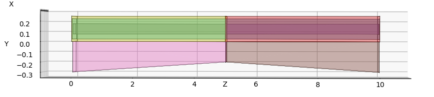

</p>

<p align="center">
  <em>Figure 1. Longitudinal view of the stacked rectangular member used for the closed-form verification</em>
</p>


The model is therefore hybrid in the participation-field sense. All rectangular components in both interpolation intervals have the same constant width $B = 0.30$.

The participation laws for the two CSF intervals are defined in the YAML inputs as follows:

```yaml
# First interval: 0 <= z <= 5
weight_laws:
  - 'upper0,upper0: 1.0 - 0.5*(1.0 - t)'

shear_weight_laws:
  - 'upper0,upper0: 1.0 - 0.8*(1.0-t)'
  - 'lower0,lower0: iso(0.2)'
  - 'middle0,middle0: iso(0.2)'

# Second interval: 5 <= z <= 10
weight_laws:
  - 'upper1,upper1: 1.0 - 0.5*t'

shear_weight_laws:
  - 'upper1,upper1: 1.0 - 0.8*t'
  - 'lower1,lower1: iso(0.2)'
  - 'middle1,middle1: iso(0.2)'
```

The first interval increases the upper-component axial/bending and shear/torsion participation fields, while the second interval applies the reverse variation. The middle and lower components retain isotropic shear/torsion coupling in both intervals through `iso(0.2)`.


This construction separates three effects that are usually coupled in a discrete section description: the geometric variation of one part of the section, the axial/bending participation variation of another part, and the independent shear/torsion participation assigned to that same part.


<p align="center">
  
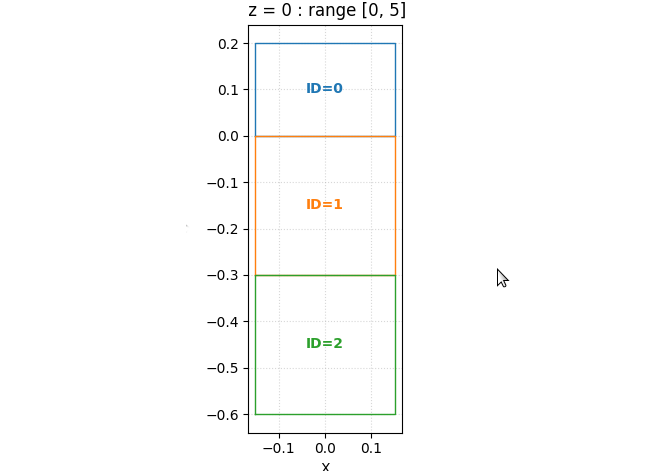

</p>


<p align="center">
  <em>Figure 2. Cross-section evaluated at z = 0.</em>
</p>


For the first interval, using the local coordinate $t \in [0,1]$, the axial/bending participation field of the upper component is

$$
w_u(t) = 0.5 + 0.5t,
$$

while its shear/torsion participation field is

$$
k_u(t) = 0.2 + 0.8t.
$$

The lower component has linearly decreasing height

$$
h_l(t) = 0.30 - 0.10t.
$$

The middle and lower components retain unit axial/bending participation. For shear/torsion, their participation is generated from the isotropic shortcut `iso(0.2)`, giving

$$
\kappa_m = 0.41666667.
$$


<!-- LATEX_PAGEBREAK -->


<p align="center">
  <em>Figure 3. axial/bending participation and shear/torsion participation assigned to the upper component over the two CSFStack intervals.</em>
</p>

<p align="center">
  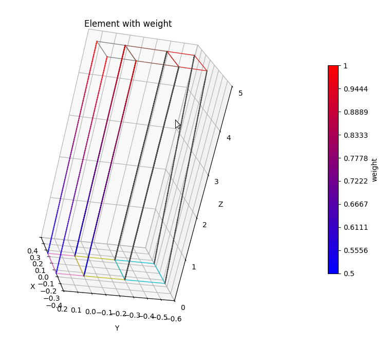
</p>


<p align="center">
  <em>Figure 4. Shear/torsion and axial/bending participation fields over the first CSF interval.</em>
</p>

<p align="center">
  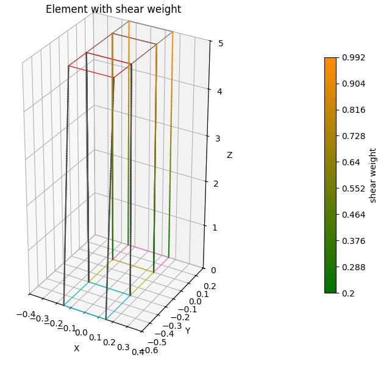
</p>


The example is arranged so that the geometric variation of the lower component exactly compensates the axial/bending participation variation of the upper component in total weighted area. In the first interval,

$$
A_u^{\mathrm{geom}} = 0.30 \cdot 0.20 = 0.06,
$$

$$
A_m^{\mathrm{geom}} = 0.30 \cdot 0.30 = 0.09,
$$

and

$$
A_l^{\mathrm{geom}}(t) = 0.30(0.30 - 0.10t).
$$


The total weighted area is therefore

$$ A(t) = w_u(t)A_u^{\mathrm{geom}} + A_m^{\mathrm{geom}} + A_l^{\mathrm{geom}}(t) = 0.21. $$


Thus, the total weighted area remains constant even though both geometry and participation fields vary continuously. The point of the example is that this compensation affects only the scalar total area. It does not preserve the internal distribution of weighted area inside the section. Consequently, the weighted centroid $C_y$ and the bending inertia $I_x$ vary continuously along the interval, while $I_y$ remains constant for this rectangular configuration.

<!-- LATEX_PAGEBREAK -->

<p align="center">
  <em>Figure 5. Sectional properties evaluated along the first interval. The total weighted area <code>A</code> remains constant, while <code>Cy</code> and <code>Ix</code> vary continuously.</em>
  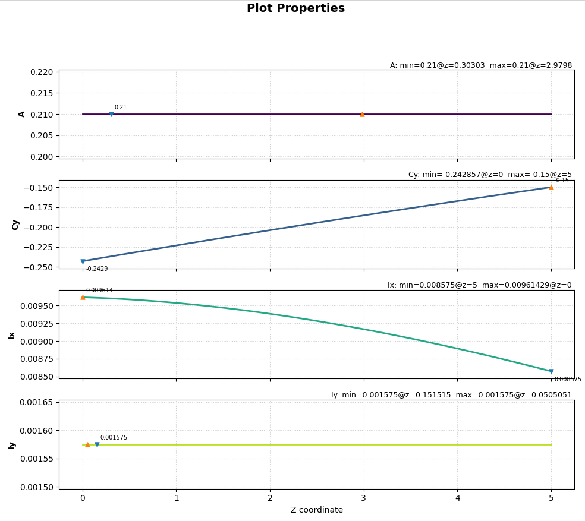
</p>

The second interval reverses the same construction. Its local coordinate is

$$
t = \frac{z-5}{5},
\qquad
0 \le t \le 1,
$$

and the lower component expands according to

$$
h_l(t) = 0.20 + 0.10t,
$$

while the upper participation fields decrease as

$$
w_u(t) = 1.0 - 0.5t,
$$

and

$$
k_u(t) = 1.0 - 0.8t.
$$

The weighted-area compensation is preserved:

$$ A(t) = (1.0-0.5t)(0.06) + 0.09 + 0.30(0.20+0.10t) = 0.21. $$


The two intervals are then assembled into a single member using `CSFStack`. The assembled object defines a continuous sectional field over the global coordinate

$$
0 \le z \le 10.
$$

<p align="center">
  <em>Figure 6. Global member obtained after assembling the two CSF intervals.</em>
  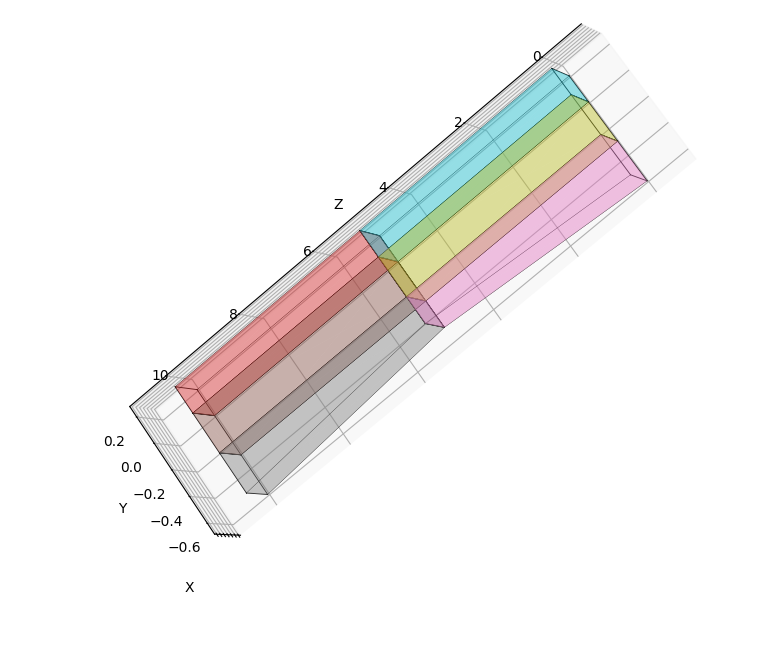
</p>

The relevant point is that the assembled model is not treated as a list of predefined sections. Instead, it is evaluated as a continuous map from the global coordinate to the corresponding section,

$$
z \longmapsto S(z).
$$

In the implementation, this evaluation is performed through

```python
stack.section_full_analysis(z, junction_side="left")
```

<p align="center">
  <em>Figure 7. Section-property profiles of the assembled CSFStack member evaluated along the global coordinate z.</em>
  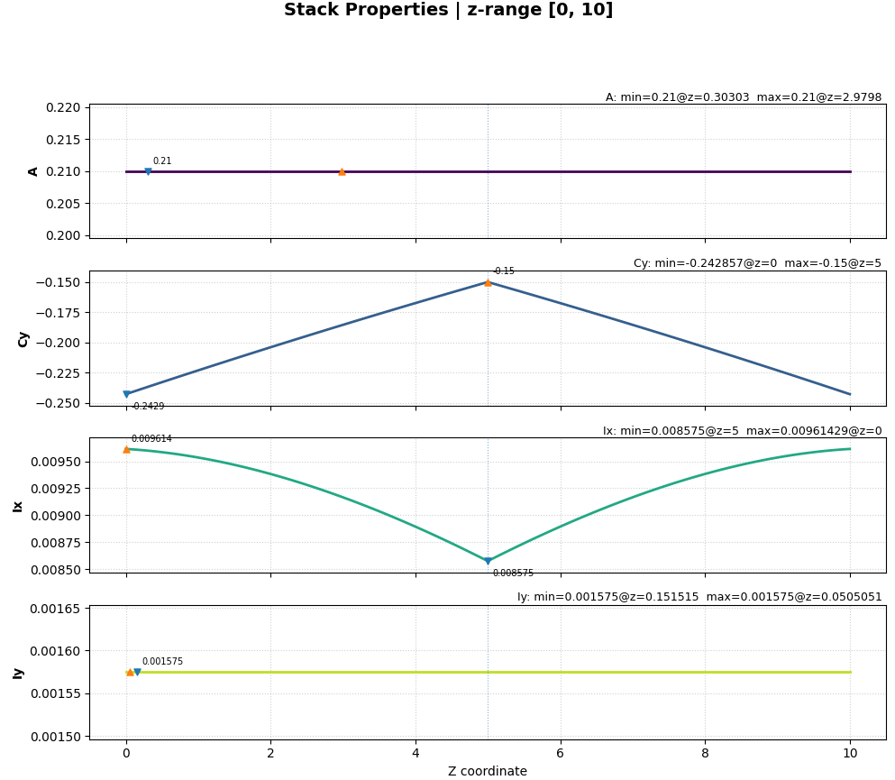

</p>


so that the user supplies only the global coordinate $z$. The active interval, the local coordinate mapping, the geometry interpolation, and the participation-field evaluation are handled internally by the stacked CSF object.

The section properties computed from the assembled CSF member are compared with an independent closed-form reference for $A$, $C_y$, $I_x$, and $I_y$ at Gauss-Lobatto stations over both intervals. The comparison gives roundoff-level discrepancies, with maximum relative error for $A$, $I_x$, and $I_y$ equal to

$$
1.09 \times 10^{-13}\%
$$

and maximum absolute error in $C_y$ equal to

$$
5.55 \times 10^{-17}.
$$


This controlled example therefore verifies the internal consistency of the continuous section-field representation at section level, before any external structural solver is involved. It shows that CSF evaluates geometry, axial/bending participation, and shear/torsion participation as continuous fields, while the plotted sectional properties reflect the combined distribution of geometry and axial/bending participation within the section.


As an additional station-wise geometric extraction, the same rectangular case is also used to report the four section interface coordinates "h1", "h2", "h3", and "h4", corresponding to the lower boundary, the lower–middle interface, the middle–upper interface, and the upper boundary of the stacked section. These coordinates are geometric quantities of the evaluated section and are analogous to the interface functions used in non-prismatic beam formulations. Their axial derivatives "dh1_dz", "dh2_dz", "dh3_dz", and "dh4_dz" are then computed from repeated evaluations of the same continuous CSF field. The centroid coordinate "Cy" is sampled from the CSF section analysis and differentiated along the member axis as "dCy_dz"; this provides a separate example of differentiating a section-derived quantity obtained from the same continuous map $z \mapsto S(z)$.


```python
section = stack.section(z)

h1, h2, h3, h4 = extract_interfaces_from_section(section)
```

The axial derivatives are then computed by evaluating the same continuous CSF field at neighbouring stations:

```python
section_minus = stack.section(z - dz)
section_plus = stack.section(z + dz)

h_minus = extract_interfaces_from_section(section_minus)
h_plus = extract_interfaces_from_section(section_plus)

dh1_dz = (h_plus["h1"] - h_minus["h1"]) / (2.0 * dz)
dh2_dz = (h_plus["h2"] - h_minus["h2"]) / (2.0 * dz)
dh3_dz = (h_plus["h3"] - h_minus["h3"]) / (2.0 * dz)
dh4_dz = (h_plus["h4"] - h_minus["h4"]) / (2.0 * dz)
```

The same procedure can be applied to any quantity extracted from the evaluated section. For example, the centroid coordinate is evaluated at neighbouring stations and differentiated in the same way:

```python
c_minus = stack.section_full_analysis(z - dz, junction_side="left")["Cy"]
c_plus = stack.section_full_analysis(z + dz, junction_side="left")["Cy"]

dCy_dz = (c_plus - c_minus) / (2.0 * dz)

```

The relevant point is that the interface coordinates, the centroid coordinate, and their axial derivatives are obtained from CSF evaluations of the same continuous sectional field. The derivative calculation therefore acts on quantities sampled from `Section` objects along the member axis.

The resulting table shows that only the lower interface `h1` varies in this example, because only the lower boundary of the lower component changes along the member. The other interfaces remain fixed, and their derivatives are therefore zero. The centroid derivative `dCy_dz` remains non-zero because the centroid follows the combined effect of the changing lower geometry and the varying upper participation field.

---

## 6. Application example: NREL 5-MW reference tower

#### Overview

The NREL 5-MW reference wind turbine tower is used as the application case. The example illustrates how a continuous CSF stiffness field can be projected onto discrete beam models and evaluated through structural response quantities.

The comparison between the reference and locally degraded configurations is used to show how different axial stiffness fields affect the resolution required by a sampled beam representation. Convergence is therefore used as a diagnostic of the sampled projection of the continuous field, rather than as the central object of the example.

The assessment has two objectives: first, to compare the sectional properties generated by CSF with analytical reference values for the linearly tapered circular tube; second, to assess the structural response obtained from the CSF-generated beam model against an independent continuous baseline. The response quantities considered are the tower-head transverse displacement $U_y$ and the torsional rotation $R_z$.

The declarative YAML format allows the undegraded and degraded configurations to be defined from the same geometric model. The degraded case is obtained by changing the longitudinal stiffness weighting law, without rebuilding the tower model from scratch. This prescribed stiffness-reduction field is consistent with damage-identification formulations in which damage is represented through changes in structural properties, including stiffness [[15]](#damage_stiffness).

The tower is modelled as a linearly tapered circular steel tube of height $L = 87.6$ m. The outer diameter tapers from $6.0$ m at the base to $3.87$ m at the top, while the wall thickness varies from $0.0351$ m to $0.0247$ m. The corresponding inner radii are $2.9649$ m at the base and $1.9103$ m at the top. The material stiffness is uniform, with $E = 210$ GPa and $G = 80.8$ GPa [[16]](#NREL_5MW).

Two configurations are analysed:

* **Case A**: the undegraded tower, representing a smooth reference case in which the sectional stiffness varies regularly along the height because of the geometric taper.
* **Case B**: the same tower geometry with a localized longitudinal stiffness degradation introduced through the participation field $w_i(z)$, leaving the polygonal geometry unchanged.

The two configurations are defined by separate YAML inputs with identical geometry. The difference between them is limited to the longitudinal stiffness weighting law.
#### Validation design

The validation compares two response-evaluation paths applied to the same tower case:

```text
Path 1: YAML → CSF continuous section-property field → Gauss section sampling → OpenSees beam model → tip response
Path 2: fixed NREL tower data → independently reconstructed continuous field → direct integration → reference tip response
```

Path 1 evaluates the response through the sampled CSF-to-OpenSees beam model. Path 2 evaluates the same tower case through a separate continuous-reference calculation. The second path does not read the YAML input files and does not call CSF section-sampling APIs; the required tower dimensions, loading data, and material cases are defined directly in the reference implementation.

The use of two separate computational procedures provides a more robust validation basis than comparing outputs generated by the same numerical backend. The two paths share the same physical case data and loading assumptions, but differ in the way the continuous sectional field is evaluated and used in the response calculation.

The reference integration grid is not fixed a priori. It is selected from a prescribed admissible tolerance over a tested sequence of integration grids. The selected grid is then used to compute the reference tower-head transverse displacement and torsional rotation.

For the independent baseline, the circular annulus is reconstructed at each axial coordinate from the interpolated outer and inner radii. The bending stiffness is evaluated as

$$
EI(z)=E(z)\frac{\pi}{4}\left(R_o(z)^4-R_i(z)^4\right),
$$

while the torsional stiffness is evaluated as

$$
GJ(z)=G(z)\frac{\pi}{2}\left(R_o(z)^4-R_i(z)^4\right),
\qquad
G(z)=\frac{E(z)}{2(1+\nu)}.
$$

The reference transverse displacement is obtained by direct integration of the bending-curvature contribution induced by the transverse tip force, the tip bending moment, and the uniform transverse load. The torsional reference rotation is obtained by integrating $M_z/GJ(z)$ along the tower height. Simpson integration is used on the selected reference grid for both response quantities.

The comparison is based on the tip-response quantities produced by the two paths: the transverse tip displacement $U_y$ and the torsional tip rotation $R_z$. For each quantity, the signed relative error is reported as

$$
\varepsilon =
100 \cdot
\frac{\text{OpenSees} - \text{reference}}
{\text{reference}} .
$$

The NREL tower provides a convenient application case because its circular annular sections admit closed-form sectional expressions. The CSF representation is more general: the same continuous-field workflow can be applied to arbitrary polygonal geometries and participation fields, even when closed-form sectional laws are not available.


#### Loading configuration

Both NREL configurations are analysed under the same loading conditions. The tower is modelled as a cantilever beam, fixed at the base and loaded at the free end. The structural model includes a transverse tip force, an axial tip force, a tip bending moment, a torsional tip moment, and a uniform transverse distributed load. These loads are not intended to reproduce a full aeroelastic operating condition; they define a controlled static test case for comparing the CSF-to-OpenSees response with the independent continuous baseline. The axial tip force is included in the OpenSees model for completeness of the structural loading configuration. It is not included in the independent continuous baseline because the reported verification quantities are limited to the transverse tip displacement $U_y$ and the torsional tip rotation $R_z$, and no axial shortening or second-order geometric effects are evaluated in this comparison.


The same loading definition is used for the undegraded and degraded towers. Therefore, differences between the two configurations are caused by the sectional stiffness field, not by changes in loading or geometry. 

### Validation

The NREL case involves two validation levels. First, the sectional properties generated from the CSF model are compared with the tabulated NREL tower data reported in Table 6-1 [[16]](#NREL_5MW), to verify that the CSF model reproduces the reference distributed properties of the tower. The maximum relative difference is below $0.04\%$ over the full tower height, confirming that the model reproduces the original NREL sectional stiffness distribution before the structural-response comparison is performed.

Second, the structural response obtained from the CSF/OpenSees model is compared with an independent analytical reference, constructed from the same geometric and material definitions without using CSF section-sampling APIs or OpenSees.

Within this validation workflow, the two CSF interaction modes serve different purposes. The declarative YAML workflow is used to define the tower model, inspect the sectional-property distributions, and generate plots and station-wise reports. The Python API is used in the CSF/OpenSees response calculation, where the CSF sectional field is evaluated programmatically at the stations required by the beam model. The independent analytical reference remains separate from this API-based CSF evaluation.


#### Case A - undegraded tower

For the undegraded configuration, the stiffness field varies smoothly and monotonically. This case is used as a baseline check of the undegraded tower model against the reference response.

The transverse displacement $U_y$ and the torsional rotation $R_z$ are evaluated across the tested discretization levels. The torsional rotation $R_z$ exhibits a small residual offset of approximately $3.44 \times 10^{-3}\%$  across all tested discretization levels. This offset is attributed to the thin-walled torsional approximation adopted internally by the CSF workflow, whereas the analytical reference uses the exact circular torsional constant $J = \tfrac{\pi}{2}(R_o^4 - R_i^4)$.


<!-- LATEX_PAGEBREAK -->

#### Case B - degraded tower

In this specific case, $E_0 = 210 \mathrm{GPa}$, corresponding to the undegraded value assigned in the YAML model as `weight: 210e9`. The degraded `weight_laws` entry overrides this constant value and defines the station-wise elastic modulus field $E(z)$ directly.


$$
E(z)=E_0 \max\left[
0.84,
1
-0.10 \exp\left(-\frac{(z-0.33L)^2}{2(0.03L)^2}\right)
-0.14 \exp\left(-\frac{(z-0.67L)^2}{2(0.03L)^2}\right)
\right]
$$

where

$$
E_0 = 210 \mathrm{GPa}.
$$


<p align="center">
  <em>Figure 8. CSF 3D representation of the degraded NREL tower case. The geometry remains tapered and continuous, while the longitudinal stiffness reduction is introduced through the participation field.</em>
</p>


<p align="center">
  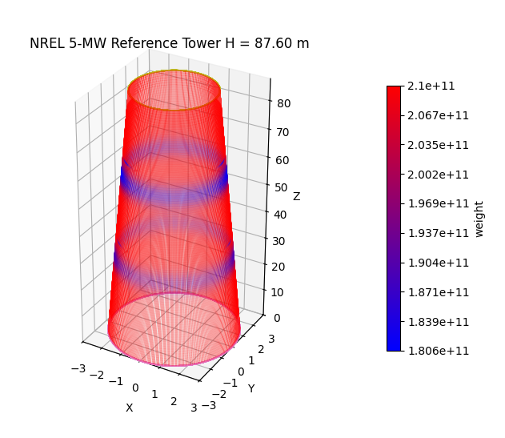
</p>

<p align="center">
  <em>Figure 9. Longitudinal stiffness degradation law applied to the NREL tower through the axial/bending participation field. The two localized reductions are centred at 0.33L and 0.67L.</em>
</p>

<p align="center">

  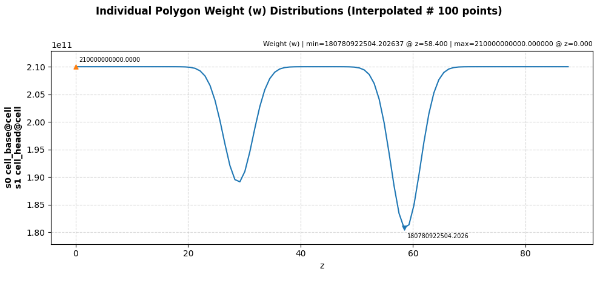
</p>

In the degraded configuration, the geometry is unchanged but the participation field $w_i(z)$ introduces localized stiffness reductions along a portion of the tower height. This produces sharper axial variation in the sectional stiffness distribution.

The convergence behaviour changes markedly relative to Case A. At low discretization levels the relative errors do not decrease monotonically with element count: the accuracy depends not only on the number of beam elements, but also on how well the sampling locations represent the degraded region of the stiffness field. Convergence stabilises once the discretization becomes sufficiently refined to resolve the localized variation.

This behaviour illustrates the main motivation for a continuous sectional representation. A coarse piecewise model with too few stations may miss or underrepresent local stiffness reductions, whereas the continuous field retains the full spatial description and the beam discretization can be refined independently until convergence is achieved.

<!-- LATEX_PAGEBREAK -->


#### Convergence results 


<p align="center">
  <em>Figure 10. Tip-displacement convergence for the undegraded NREL tower case.</em>
</p>


<p align="center">
    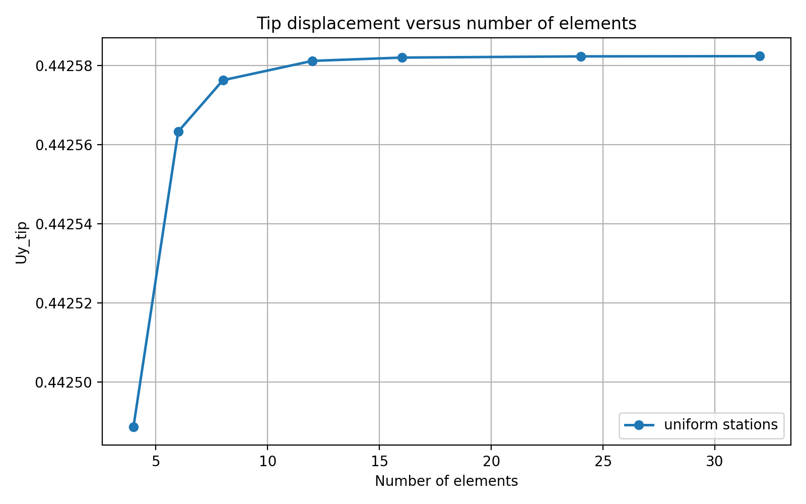
  
</p>


<p align="center">
  <em>Figure 11. Tip-displacement convergence for the degraded NREL tower case.</em>
</p>

<p align="center">
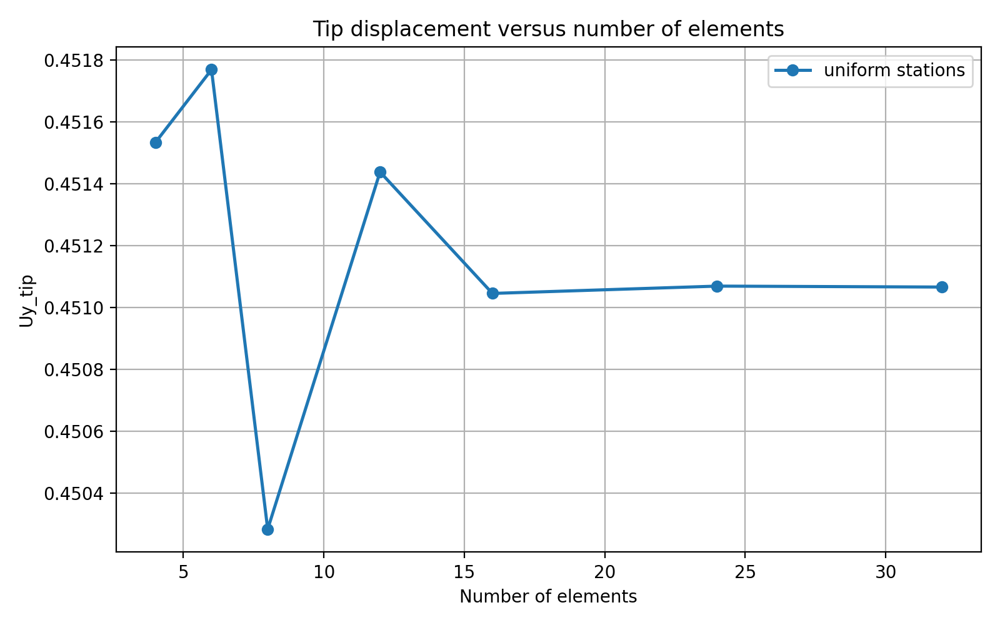
</p>


<p align="center">
   <em>Figure 12. Continuous variation of selected sectional properties for the degraded NREL tower case. The localized reductions arise from the prescribed axial/bending participation field and are reflected in the weighted axial and bending stiffness distributions.</em>
  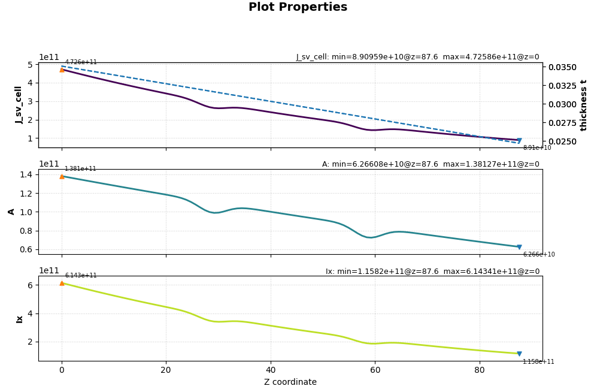
</p>

 
Table 1 reports the relative errors in tip displacement $U_y$ and torsional rotation $R_z$ as a function of the number of beam elements, for both configurations.

| Scenario   | Elements | $\varepsilon_{U_y}$ (%) | $\varepsilon_{R_z}$ (%) |
|-------------|----------:|------------------------:|------------------------:|
| Undegraded | 4  | −2.08×10⁻² | −6.49×10⁻³ |
| Undegraded | 6  | −3.99×10⁻³ | −4.05×10⁻³ |
| Undegraded | 8  | −1.06×10⁻³ | −3.63×10⁻³ |
| Undegraded | 12 | +3.93×10⁻⁵ | −3.48×10⁻³ |
| Undegraded | 16 | +2.27×10⁻⁴ | −3.45×10⁻³ |
| Undegraded | 24 | +2.97×10⁻⁴ | −3.44×10⁻³ |
| Undegraded | 32 | +3.08×10⁻⁴ | −3.44×10⁻³ |
| Degraded   | 4  | +1.04×10⁻¹ | +2.16×10⁻¹ |
| Degraded   | 6  | +1.56×10⁻¹ | +1.55×10⁻¹ |
| Degraded   | 8  | −1.73×10⁻¹ | −2.01×10⁻¹ |
| Degraded   | 12 | +8.28×10⁻² | +7.69×10⁻² |
| Degraded   | 16 | −4.29×10⁻³ | −5.67×10⁻³ |
| Degraded   | 24 | +9.57×10⁻⁴ | −2.75×10⁻³ |
| Degraded   | 32 | +2.80×10⁻⁴ | −3.48×10⁻³ |


> **Note:** At high discretization levels the relative error in $U_y$ stabilises 
> near zero ($\sim 10^{-4}\,\%$). This residual level is within the numerical accuracy expected from the independently selected reference integration grid, which in this case corresponds to 2001 points, and does not indicate a modelling inconsistency.

The continuous stiffness representation enables this convergence study. A fixed discrete table, such as the original NREL reference definition with properties provided at 11 stations [[16]](#NREL_5MW), specifies the sectional description only at the prescribed stations; refinement beyond those stations requires an additional interpolation or reconstruction assumption. The continuous representation decouples the member definition from its numerical discretization: the same YAML input can be sampled at any resolution, allowing convergence toward the reference solution to be progressively assessed.


The degraded case makes this distinction explicit. At 8 elements the error in $U_y$ is larger than at 6, and the sign reverses - a non-monotone behaviour indicating insufficient axial resolution near the degraded region. This diagnostic is only possible because the reference stiffness field is defined continuously. Without a continuous reference representation, convergence behaviour cannot be assessed independently of the adopted station discretization.

#### Observations

The two cases exhibit qualitatively different convergence regimes under the same beam formulation. The undegraded case converges rapidly and uniformly, whereas the degraded case is more sensitive to axial discretization before stabilising.

This interpretation is enabled by the continuous nature of the sectional representation, rather than by treating the station discretization as the model itself.

---


## 7. Conclusions

The main contribution of CSF is the definition of a solver-agnostic continuous representation for non-prismatic structural members, in which polygonal geometry and material participation fields are expressed as evaluable functions of the axial coordinate. These fields are independent of the downstream discretization and can be sampled at arbitrary stations to generate solver-specific input data.

The controlled stacked-section example isolates the construction of this representation at section level, before any structural solver is introduced. It demonstrates how geometric interpolation and participation fields combine within the evaluated section, and how their interaction affects derived sectional quantities such as centroid location and bending inertia, while remaining consistent across intervals.

The NREL tower case extends this formulation to a realistic tapered structural member. The undegraded configuration verifies geometry-driven variation of sectional properties, while the degraded configuration shows how localized stiffness changes can be introduced through participation fields without modifying the geometric definition. The convergence study further confirms that numerical discretization can be refined independently of the continuous representation.

Together, these examples show a clear separation between the definition of the sectional model, its numerical sampling, and the solver-specific data structures. This separation enables consistent reuse of the same member definition across inspection, validation, and structural analysis workflows.

CSF provides a continuous representation of the sectional model that can be sampled and exported into solver-compatible formats without altering the underlying model definition.

### Limitations

The current formulation assumes a straight element axis, linear vertex interpolation between reference stations, and fixed topology within each interpolation interval. Curved member axes, disappearing or emerging zones, and higher-order geometric evolution are not currently supported.

For torsion, the built-in CSF quantities are limited to selected engineering read-outs. Standard thin-walled open and closed sections can be treated through the corresponding thin-walled estimates, while solid rectangular sections may be assigned an empirical rectangular-section torsional estimate. This quantity is an engineering approximation and should not be interpreted as a general Saint-Venant torsional solution for arbitrary cross-sections or for shear-non-uniform participation fields.

General solid sections, multi-cell configurations, and sections requiring warping-based Saint-Venant analysis must be evaluated by an external sectional-analysis backend. For isotropic cases, this role can be fulfilled through the `csf_sp` bridge to `sectionproperties`. However, when CSF is used to model non-isotropic participation fields, where the axial/bending and shear/torsion participation fields are prescribed independently, the torsional problem no longer falls within the isotropic `sectionproperties` workflow. In such cases, more general numerical sectional formulations are required, for example dedicated finite-element torsion models.

Accordingly, CSF should be interpreted as the continuous sectional-field representation and sampling layer. It defines, evaluates, and exports geometry and participation fields; torsional quantities outside its built-in approximation domain must be computed by an appropriate external sectional solver.

### Future extensions

These limitations suggest three natural extensions of the present framework. First, automatic evaluation of derivatives of sectional properties and participation-weighted stiffness fields would facilitate coupling with non-prismatic beam formulations that explicitly require longitudinal gradients of geometric and constitutive quantities. Second, support for curved member axes would extend the applicability of the framework beyond straight beam-like structures. Third, tighter integration with nonlinear structural solvers could allow participation fields to evolve during the analysis, enabling applications beyond the current static sectional representation.


---

## Declaration of competing interest

The author declares no competing interests.

## Funding

This research received no external funding.

## Declaration of generative AI and AI-assisted technologies in the manuscript preparation process

During manuscript preparation, generative AI-assisted tools were used to support language editing, clarity checking, and structural revision of author-prepared text. The author reviewed, revised, and approved all content and takes full responsibility for the final manuscript. No generative AI tools were used to generate research data, perform numerical analyses, create results, or produce evidential figures.


## References

[1] <a id="vabs"></a> VABS, *Variational Asymptotic Beam Sectional Analysis*. https://analyswift.com/vabs-cross-sectional-analysis-tool-for-composite-beams/

[2] <a id="becas"></a> BECAS, *BEam Cross section Analysis Software*. https://becas.dtu.dk/

[3] <a id="secprop"></a> sectionproperties *python package for the analysis of arbitrary cross-sections using the finite element method*.
https://github.com/robbievanleeuwen/section-properties

[4] <a id="balduzzi"></a>   G. Balduzzi, M. Aminbaghai, J. Füssl, F. Auricchio, Non-prismatic beams: a simple and effective Timoshenko-like model, Int. J. Solids Struct. 90 (2016) 236–250. https://doi.org/10.1016/j.ijsolstr.2016.03.022

[5] <a id="balduzzi2"></a>  G. Balduzzi, M. Aminbaghai, F. Auricchio, J. Füssl, Planar Timoshenko-like model for multilayer non-prismatic beams, Int. J. Mech. Mater. Des. 14 (2018) 51–70. https://doi.org/10.1007/s10999-016-9360-3

[6] <a id="opensees"></a> McKenna, F. OpenSees: A Framework for Earthquake Engineering Simulation. Computing in Science & Engineering, 13(4), 58–66, 2011. https://doi.org/10.1109/MCSE.2011.66  
  Project website: https://opensees.berkeley.edu/

[7] <a id="abaqus"></a> Dassault Systèmes, *Abaqus finite element analysis software*. https://www.3ds.com/products/simulia/abaqus/

[8] <a id="ansys"></a> Ansys Inc., Ansys Mechanical User's Guide, Release 2023 R1, Ansys Inc., Canonsburg, PA, 2023. https://www.ansys.com/

[9] <a id="beamdyn"></a> Wang, Q., Sprague, M. A., Jonkman, J., Johnson, N., and Jonkman, B. *BeamDyn: a high-fidelity wind turbine blade solver in the FAST modular framework*. Wind Energy, 20(8), 1439–1462, 2017. https://doi.org/10.1002/we.2101

[10] <a id="wisdem"></a> Dykes, K., Ning, S. A., Scott, G., Graf, P., Barter, G., Bortolotti, P., Key, A., Abbas, N., Gaetner, E., Quick, J., Frontin, C., Zalkind, D., Parsons, T., King, R., and Quon, E. *WISDEM® v3.15.2 2024 (Wind-Plant Integrated System Design and Engineering Model)*. National Renewable Energy Laboratory, 2024. https://doi.org/10.11578/dc.20240502.1

[11] <a id="frame3dd"></a> Gavin, H. P. *Frame3DD: Static and Dynamic Structural Analysis of 2D and 3D Frames*. https://frame3dd.sourceforge.net/


[12] <a id="polygon_moments"></a> Steger, C. *On the Calculation of Arbitrary Moments of Polygons*. Technical Report FGBV-96-05, Forschungsgruppe Bildverstehen, Informatik IX, Technische Universität München, October 1996. https://mv.in.tum.de/_media/members/steger/publications/1996/fgbv-96-05-steger.pdf

[13] <a id="saintven"></a> <a id="walltors"></a> Hughes, A. *Design of Steel Beams in Torsion*. SCI Publication P385, The Steel Construction Institute, 2011. https://www.steelconstruction.info/images/6/6f/Sci_p385.pdf

[14] <a id="bredt"></a> Schmidrathner, C. *Validation of Bredt’s formulas for beams with hollow cross sections by the method of asymptotic splitting for pure torsion and their extension to shear force bending*. Acta Mechanica, 230, 4035–4047, 2019. https://doi.org/10.1007/s00707-019-02441-8

[15] <a id="damage_stiffness"></a> Doebling, S. W., Farrar, C. R., Prime, M. B., and Shevitz, D. W. *Damage Identification and Health Monitoring of Structural and Mechanical Systems from Changes in Their Vibration Characteristics: A Literature Review*. Los Alamos National Laboratory Report LA-13070-MS, Los Alamos National Laboratory, 1996. https://doi.org/10.2172/249299

[16] <a id="NREL_5MW"></a> Jonkman, J., Butterfield, S., Musial, W., and Scott, G. *Definition of a 5-MW Reference Wind Turbine for Offshore System Development*. NREL/TP-500-38060, National Renewable Energy Laboratory, 2009. https://doi.org/10.2172/947422

---

