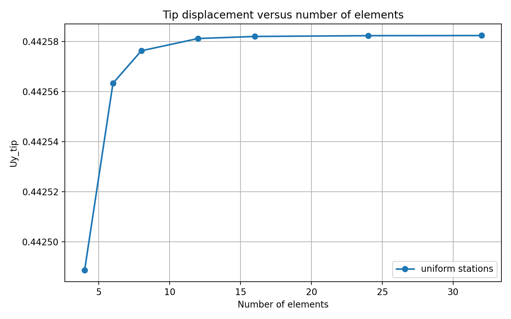
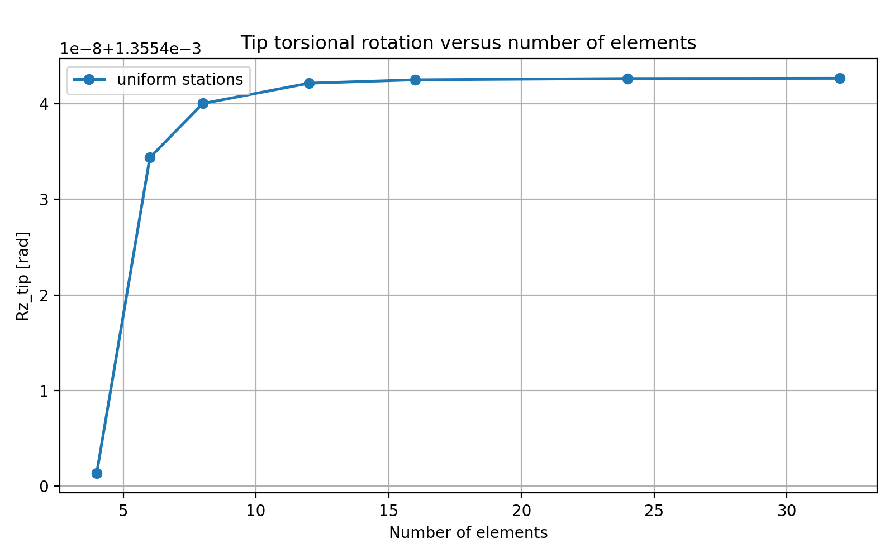
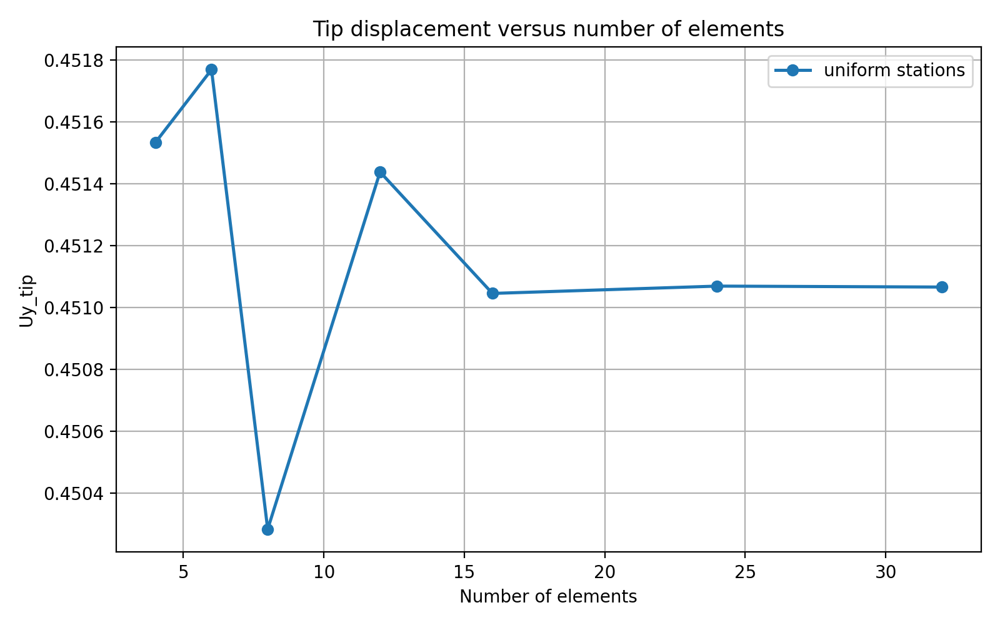
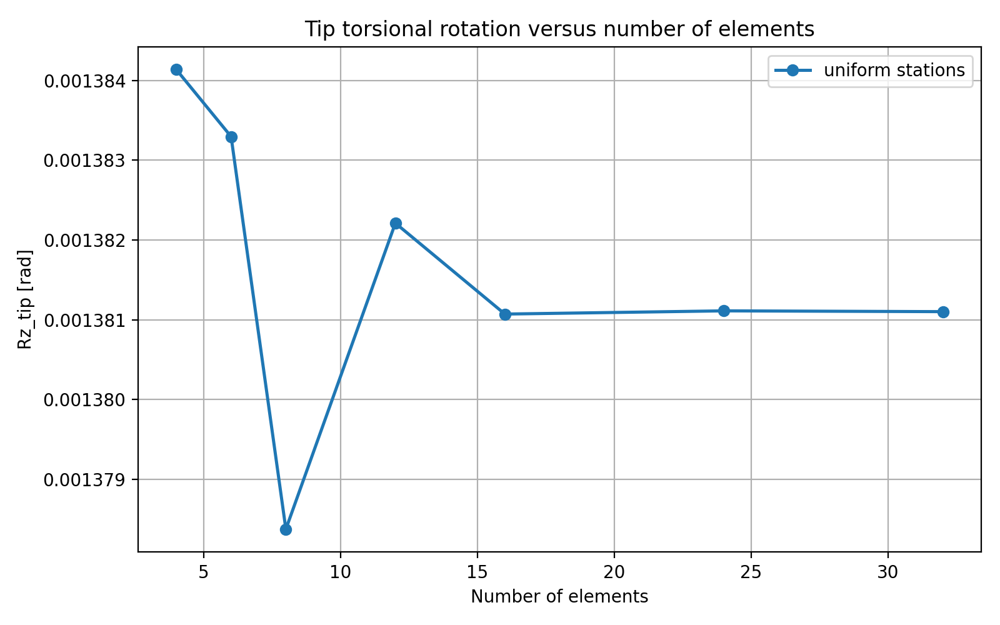

# Validation comparison - all scenarios
the objective is not only to verify numerical agreement, but also to observe how the convergence behaviour changes when the underlying sectional stiffness field becomes less smooth
> ### Reproducibility environment
>
> This validation case assumes that the repository and Python environment have been configured as described in:
>
> [Reproducibility environment](https://github.com/giovanniboscu/continuous-section-field/blob/main/docs/aes/reproducibility_environment.md)
>
> The commands in this document must be executed from:
>
> ```bash
> docs/aes/nrel_case
> ```

This report compares the tip response obtained from the CSF-to-OpenSees workflow with an independent analytical reference.

The comparison is performed for two tower configurations:

1. the undegraded NREL 5-MW reference tower;
2. the same tower with a localized longitudinal stiffness degradation law.

The objective is not only to verify numerical agreement, but also to observe how the convergence behaviour changes when the underlying sectional stiffness field becomes less smooth because of localized degradation.

## Conceptual structure

Both scenarios are based on the same tower geometry and the same loading assumptions. The difference is the longitudinal stiffness distribution.

The undegraded configuration represents a smooth reference case. The sectional stiffness varies regularly along the tower height because of the tower taper.

The degraded configuration represents a more demanding case. The geometry remains unchanged, but the stiffness distribution is modified locally by the degradation law. This creates sharper variations along the tower axis.

For this reason, the two cases test different aspects of the workflow:

- the undegraded case checks the beam model under smooth stiffness variation;
- the degraded case checks the sensitivity of the same beam model when the stiffness distribution contains localized reductions.

The same beam formulation therefore exhibits markedly different convergence behaviour depending on the smoothness of the stiffness distribution.

## Reference solution

The reference values used in the comparison are obtained from an independent analytical integration procedure.

This reference procedure reads the same YAML input files used by the beam model, but it does not use OpenSees and does not use the same tools. It reconstructs the required stiffness distributions directly from the input data and evaluates the response by continuous integration.

The comparison therefore follows two separate computational paths:

```text
YAML input → sectional properties → beam model → tip response
```

```text
YAML input → sectional properties → analytical integration → reference tip response
```

Agreement between the two paths provides a validation than comparing two outputs generated by the same numerical machinery.

## Key quantities

The comparison focuses on the following response quantities:

- `Uy`: transverse tip displacement;
- `Rz`: torsional tip rotation;
- `Section evaluations`: number of section property samples used by the beam model;
- relative error: `100 * (OpenSees - reference) / reference`, reported as a percentage.

The number of section evaluations is reported because it indicates the axial resolution used to extract the sectional properties from the YAML input.

## Numerical tables

The complete numerical comparison tables are maintained in the generated CSV file:

[validation_comparison_summary_all.csv](https://github.com/giovanniboscu/continuous-section-field/blob/main/docs/aes/nrel_case/validation_comparison_summary_all.csv)

The CSV file is the reference source for the numerical values.

The relative-error columns are reported in percent and are computed as `100 * (OpenSees - reference) / reference`. The analytical reference is obtained by Simpson integration over 2001 axial points. In the undegraded case, the torsional response stabilizes rapidly: beyond approximately 8–12 beam elements, further axial refinement produces only negligible variation in `Rz`. The remaining offset relative to the independent analytical reference stays very small, of order `10^-3 %` (specifically ≈ `3.44×10^-3 %`), and is mainly attributed to the difference between the torsional constant used in the analytical reference and the torsional constant transferred by the CSF/OpenSees workflow. The analytical reference uses the exact polar torsional constant of a circular annulus, `J = π/2 (Ro^4 - Ri^4)`, whereas the beam model uses the thin-walled closed-cell Saint-Venant approximation (Bredt–Batho formula).


## Generate the comparison report

After the OpenSees analyses and the independent analytical references have been executed for both scenarios, the final comparison report is generated with:

```bash
python3 compare_validation_results.py
```

This script collects the numerical outputs produced by the CSF-to-OpenSees runs and compares them with the independent analytical reference values.

The comparison includes both validation scenarios:

- undegraded NREL tower;
- degraded NREL tower.

For each scenario, the script evaluates the tip response errors for the tested beam discretizations and generates the summary tables and convergence plots used in this report.

In particular, it compares:

- transverse tip displacement `Uy`;
- torsional tip rotation `Rz`;
- section-evaluation count for each discretization level.

The purpose of this step is to assemble the final validation evidence in a single reproducible output. It connects the raw OpenSees response files and the independent analytical-reference results into the convergence study reported below.

## Case A - undegraded NREL tower

The undegraded NREL tower is the baseline validation case.

In this configuration, the sectional stiffness varies smoothly and monotonically along the tower height. This makes the case suitable for checking that the CSF-defined tower properties are correctly transferred to the OpenSees beam formulation.

The expected behaviour is rapid convergence. Since the stiffness field is smooth, even a limited number of beam elements should reproduce the reference response with small error.

The convergence plots provide the clearest visualization of this behaviour.





The numerical values for this case are reported in [validation_comparison_summary_all.csv](https://github.com/giovanniboscu/continuous-section-field/blob/main/docs/aes/nrel_case/validation_comparison_summary_all.csv).


The numerical results confirm the expected behaviour. The transverse displacement `Uy` converges very rapidly, with small error already at low discretization levels.

The torsional rotation `Rz` is also stable across the discretization sequence. The remaining difference is small and nearly constant over the tested mesh refinements.

This case therefore verifies that, for a smooth sectional stiffness field, the CSF-to-OpenSees workflow reproduces the independent reference response with very limited discretization demand.

## Case B - degraded NREL tower

The degraded NREL tower is the critical convergence case.

In this configuration, the tower geometry is unchanged, but the longitudinal stiffness field is locally reduced. The degradation law introduces sharper variations along the member axis. This makes the response more sensitive to how the continuous stiffness field is sampled and transferred into the beam model.

The degraded configuration shows that convergence quality cannot be inferred solely from the behaviour observed in smooth undegraded configurations. A discretization that is sufficient for the baseline tower may be less reliable when localized stiffness reductions are present.

The convergence plots provide the clearest visualization of this behaviour.





The numerical values for this case are reported in [validation_comparison_summary_all.csv](https://github.com/giovanniboscu/continuous-section-field/blob/main/docs/aes/nrel_case/validation_comparison_summary_all.csv).


The degraded case shows a less regular convergence pattern at low discretization levels. The relative errors do not decrease monotonically from 4 to 12 elements. This is consistent with the presence of localized stiffness variation: the accuracy depends not only on the number of elements, but also on how well the sampling locations represent the degraded portions of the stiffness field.

The response becomes stable when the discretization is refined. Further refinement keeps the response close to the independent reference, as reported in the generated CSV table.

This case demonstrates why the degraded configuration is a more severe validation case than the undegraded tower. The same OpenSees beam formulation and the same transfer workflow are used, but the localized stiffness field requires finer axial representation to recover stable convergence.

## Observations

The undegraded configuration converges rapidly even with a limited number of beam elements. This is consistent with the smooth and monotonic variation of the tower stiffness.

The degraded configuration requires finer discretization to recover stable convergence. The local stiffness reductions introduce sharper axial variation, making coarse piecewise discretizations less reliable.

This behaviour highlights one of the main motivations for using a continuous section-field representation. A simple piecewise model with too few stations may miss or underrepresent local stiffness variations, while a denser discretization converges toward the continuous reference.

The convergence plots make the difference between the two convergence regimes immediately observable. The undegraded case shows rapid and regular convergence, while the degraded case shows higher sensitivity to axial discretization before stabilizing.

## Main conclusions

The comparison supports the following conclusions:

1. For smooth, non-degraded stiffness variation, the CSF-to-OpenSees model converges rapidly toward the independent analytical reference.
2. For localized degradation, the response is more sensitive to axial discretization.
3. Coarse piecewise beam discretizations can be adequate for smooth tapering but less reliable when stiffness reductions are localized.
4. The independent analytical reference confirms that the observed convergence behaviour is not an artifact of the OpenSees model alone.
5. The degraded case provides the most informative validation scenario because it exposes the need for adequate sampling of the continuous stiffness field.

