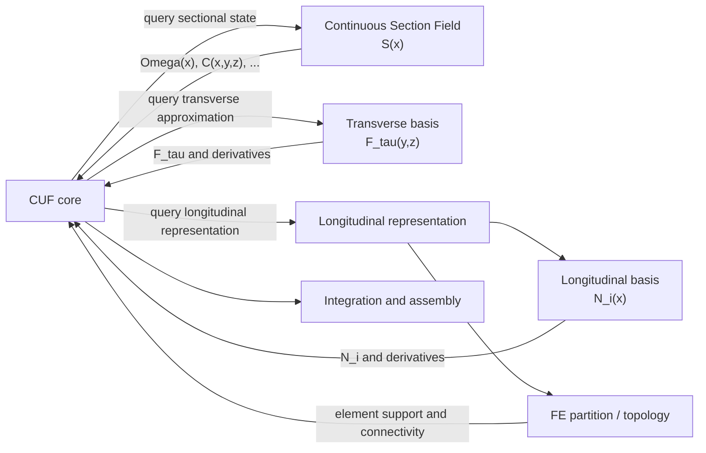

> **CUF solver documentation**
>
> Implementation details, usage instructions, configuration, and examples for the CUF solver are available in the dedicated README:
>
> **[Inside the CSF-CUF](../../cuf/readme.md)**

# The foundational idea behind CSF-CUF

The mathematical idea underlying the Carrera Unified Formulation is not specific to structural mechanics. It begins with the general possibility of representing, or approximating, a function through an expansion in a chosen set of basis functions.

Consider a scalar function $f(y,z)$ defined over a two-dimensional domain. Given a suitable family of functions $F_\tau(y,z)$, one may formally write

```math
f(y,z)
=
\sum_{\tau=1}^{\infty}
F_\tau(y,z)a_\tau
```

where the coefficients $a_\tau$ determine the contribution of each basis function. Depending on the mathematical setting, the functions $F_\tau$ may be monomials, orthogonal polynomials, trigonometric functions, or other suitable basis functions.

In practical calculations, the infinite expansion is replaced by a finite one:

```math
f(y,z)
\simeq
\sum_{\tau=1}^{M}
F_\tau(y,z)a_\tau
```

This truncation defines a finite-dimensional approximation space. The function can reproduce only the distributions generated by the selected functions $F_1,\ldots,F_M$. Increasing $M$ enlarges this space and permits progressively richer distributions to be represented.

The Carrera Unified Formulation applies this general mathematical idea to the displacement field of a structural model.

Consider a beam whose longitudinal coordinate is $x$ and whose cross-section is described by the transverse coordinates $y$ and $z$. For every fixed value of $x$, each displacement component is a function defined over the cross-section. Its dependence on the transverse coordinates can therefore be approximated through a selected family of expansion functions.

The generic CUF representation of the displacement field is

```math
\mathbf{u}(x,y,z)
\simeq
\sum_{\tau=1}^{M}
F_\tau(y,z)\mathbf{u}_\tau(x)
```

The coefficients are now vector functions of $x$, because the expansion is performed over the cross-sectional coordinates. At every longitudinal position, the functions $\mathbf{u}_\tau(x)$ determine the contribution of each transverse expansion function to the displacement field.

This equation should not be interpreted simply as an alternative way of writing the displacement field. It defines a finite-dimensional approximation of its dependence on the cross-sectional coordinates.

For a Maclaurin-type polynomial expansion, for example, the transverse basis may contain

```math
1,\quad
y,\quad
z,\quad
y^2,\quad
yz,\quad
z^2,\quad
\ldots
```

A scalar displacement component can then be written as

```math
u(x,y,z)
\simeq
u_1(x)
+
y u_2(x)
+
z u_3(x)
+
y^2 u_4(x)
+
yz u_5(x)
+
z^2 u_6(x)
+
\cdots
```

The functions $u_1(x),u_2(x),\ldots$ are longitudinal coefficients of the same displacement field. They are not separate physical displacement fields.

The selected transverse expansion defines the admissible cross-sectional kinematics. A low-order expansion permits only a restricted family of deformation patterns, while enriching the approximation space allows increasingly complex cross-sectional deformation and warping modes to be represented.

The **kinematic theory** is therefore determined by the selected transverse approximation space. CUF does not need to begin with a predefined beam theory: different classical and higher-order models can be generated within the same formulation by changing the functions $F_\tau(y,z)$, their number, or their approximation order.

---

## Longitudinal approximation and finite-element discretization

The functions $\mathbf{u}_\tau(x)$ remain unknown functions of the longitudinal coordinate.

When a finite-element discretization is adopted along the beam axis, their variation inside each longitudinal element can be approximated through a selected longitudinal basis $N_i(x)$:

```math
\mathbf{u}_\tau(x)
\simeq
\sum_i
N_i(x)\mathbf{q}_{\tau i}
```

Substitution into the CUF expansion gives

```math
\mathbf{u}(x,y,z)
\simeq
\sum_i
\sum_{\tau=1}^{M}
N_i(x)
F_\tau(y,z)
\mathbf{q}_{\tau i}
```

The complete displacement approximation therefore contains two distinct approximation spaces:

* the transverse basis $F_\tau(y,z)$, which describes the admissible variation over the cross-section;
* the longitudinal basis $N_i(x)$, which describes the variation along the beam axis.

The longitudinal basis must in turn be distinguished from the finite-element discretization itself.

The **finite-element topology** determines how the longitudinal domain is partitioned into elements and how those elements are connected.

The **longitudinal basis** determines how the unknown field is represented inside each element.

Schematically,

```text
longitudinal representation
│
├── finite-element partition and connectivity
│
└── longitudinal basis N_i(x)
```

These two ingredients cooperate, but they do not represent the same modelling choice.

Changing the longitudinal element partition changes where the domain is discretized. Changing the longitudinal basis changes how the solution is approximated within that discretization.

Neither the transverse nor the longitudinal approximation defines the physical geometry or the material distribution of the member.

---

## From a prismatic section to a Continuous Section Field

For a prismatic beam, the physical domain can be written as

```math
\mathcal{B}
=
[0,L]\times\Omega
```

where the cross-sectional domain $\Omega$ is independent of the longitudinal coordinate $x$.

The same physical cross-section is therefore present at every longitudinal position.

In the CSF-CUF formulation, this fixed sectional description is replaced by a sectional state that can vary continuously along the beam axis:

```math
x
\longmapsto
\mathcal{S}(x)
```

The object $\mathcal{S}(x)$ represents the physical section existing at the longitudinal coordinate $x$.

Schematically,

```math
\mathcal{S}(x)
\longrightarrow
\{
\Omega(x),
\mathbf{C}(x,y,z),
\ldots
\}
```

where $\Omega(x)$ is the physical cross-sectional domain and $\mathbf{C}(x,y,z)$ represents the local constitutive properties.

The corresponding three-dimensional body is therefore no longer represented by a Cartesian product with a fixed section, but by

```math
\mathcal{B}
=
\{
(x,y,z)
:
x\in[0,L],
\;
(y,z)\in\Omega(x)
\}
```

The transition from the prismatic description to the variable-section description can be summarized as

```math
\Omega
\longrightarrow
\Omega(x),
\qquad
\mathbf{C}(y,z)
\longrightarrow
\mathbf{C}(x,y,z)
```

This modification concerns the **physical description of the member**.

It does not, by itself, require a modification of the standard CUF transverse approximation:

```math
\mathbf{u}(x,y,z)
\simeq
\sum_{\tau=1}^{M}
F_\tau(y,z)\mathbf{u}_\tau(x)
```

For the variable-section extension considered here, the transverse functions may therefore retain the form

```math
F_\tau = F_\tau(y,z)
```

while the longitudinal variation of geometry and material is supplied independently by the Continuous Section Field through $\mathcal{S}(x)$.

The important distinction is that the physical variation of the member is represented by the sectional field itself; it does not need to be encoded into either the transverse or the longitudinal approximation functions.

---

## How the sectional state enters the formulation

Under the usual small-strain linear-elastic assumptions, the internal virtual work can be written as

```math
\delta W_{\mathrm{int}}
=
\int_0^L
\int_{\Omega(x)}
\delta\boldsymbol{\varepsilon}^{T}
\mathbf{C}(x,y,z)
\boldsymbol{\varepsilon}
\,
d\Omega
\,
dx
```

The physical sectional state therefore enters the governing formulation through both

```math
\Omega(x)
```

and

```math
\mathbf{C}(x,y,z)
```

while the displacement approximation introduces the transverse functions $F_\tau(y,z)$ and the longitudinal functions $N_i(x)$.

At the architectural level, the formulation consequently brings together four distinct kinds of information:

* the **physical sectional state**, supplied by the Continuous Section Field;
* the **transverse approximation**, supplied by the selected transverse basis;
* the **longitudinal approximation**, supplied by the selected longitudinal basis;
* the **longitudinal discretization**, supplied by the finite-element topology.

These descriptions can remain separate while being combined by the CUF core during integration and assembly.



The diagram is therefore not an additional modelling assumption. It is the computational representation of separations already visible in the formulation.

The CUF core does not need to construct the physical section, prescribe a particular transverse expansion family, or identify the longitudinal basis with the finite-element topology.

It combines the quantities supplied by these independent descriptions according to the governing formulation.

---

## Continuous sectional field and numerical quadrature

The Continuous Section Field is defined independently of the numerical quadrature used to evaluate the governing equations.

At a longitudinal Gauss point $x_g$, the CUF solver queries the sectional field at that coordinate:

```math
x_g
\longrightarrow
\mathcal{S}(x_g)
\longrightarrow
\{
\Omega(x_g),
\mathbf{C}(x_g,y,z),
\ldots
\}
```

The Gauss point therefore does not define the sectional properties. It only identifies a longitudinal position at which the independently defined sectional field is evaluated.


This distinction separates the **physical description of the member** from the **numerical points used to integrate the governing equations**.

The quadrature determines where the field is sampled; it does not define how geometry or material properties vary along the member.

Geometry and material variation are properties of the Continuous Section Field, while the transverse basis, longitudinal basis, finite-element discretization, and quadrature rules determine how this physical description is used in the numerical solution.

For the complete variable-section formulation, see [CSF-CUF Formulation for Directly Prescribed Variable Sections](../model/csf_cuf_formal_variable_section_extension.md).
